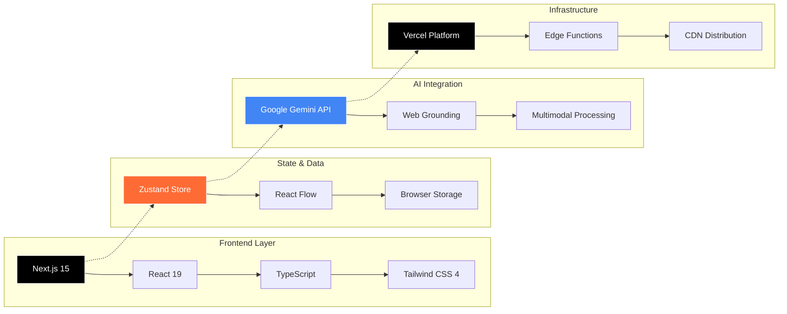
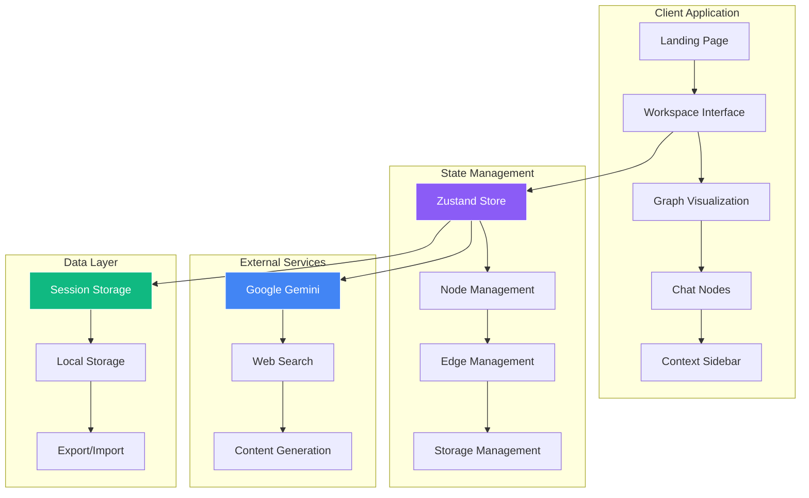

# Aether AI - Chat Multiverse

<link rel="preconnect" href="https://fonts.googleapis.com">
<link rel="preconnect" href="https://fonts.gstatic.com" crossorigin>
<link href="https://fonts.googleapis.com/css2?family=Major+Mono+Display&family=Space+Grotesk:wght@300..700&display=swap" rel="stylesheet">

<div align="center">
  <div style="display: flex; align-items: center; justify-content: center; gap: 20px; margin-bottom: 20px;">
    
    <h1 style="font-family: 'Major Mono Display', monospace; font-size: 48px; margin: 0; color: #333;">Aether</h1>
  </div>
  
  [](https://github.com/sbeeredd04/Aether/stargazers)
  [](https://github.com/sbeeredd04/Aether/blob/main/LICENSE)
  [](https://github.com/sbeeredd04/Aether/issues)
  [](https://github.com/sbeeredd04/Aether/graphs/contributors)

  **Transform your AI conversations into explorable trees of thought with the Chat Multiverse**
  
  [**LIVE DEMO**](https://aether.sriujjwalreddy.com) • [**DOCUMENTATION**](./docs/README.md) • [**REPORT BUG**](https://github.com/sbeeredd04/Aether/issues) • [**FEATURE REQUEST**](https://github.com/sbeeredd04/Aether/issues)
  
  **Developed by [Sri Ujjwal Reddy](https://github.com/sbeeredd04) | [Portfolio](https://sriujjwalreddy.com)**
</div>

---

## Table of Contents

- [About](#about)
- [Key Features](#key-features)
- [Quick Start](#quick-start)
- [Usage](#usage)
- [Architecture](#architecture)
- [Contributing](#contributing)
- [Roadmap](#roadmap)
- [License](#license)
- [Support](#support)

---

## About

Aether AI - Chat Multiverse revolutionizes how you interact with artificial intelligence by transforming linear conversations into visual, explorable trees. Enter a multiverse where every conversation branches into infinite possibilities. Instead of losing context in long chat threads, you can:

- **Branch conversations** from any point to explore different ideas
- **Navigate visually** through your conversation history across the multiverse
- **Compare responses** from multiple AI models side-by-side
- **Never lose context** with persistent conversation trees
- **Experience modern design** with Major Mono Display typography and glass morphism UI


## Key Features

### Visual Conversation Trees
Transform linear chats into explorable graphs. Every conversation becomes a visual journey you can navigate and explore.

### Multiple AI Models
- Gemini 2.0 Flash
- Thinking models
- Image generation capabilities
- Web-grounded responses

### Infinite Branching
Create unlimited conversation branches from any point. Explore different answers without losing your original thread.

### Rich Media Support
- Upload images, audio, and files
- Generate images directly in conversations
- Full multimedia AI interactions

### Web-Grounded Responses
Get answers backed by real-time web search. Perfect for research, fact-checking, and current events.

### Developer Friendly
- Full markdown support with syntax highlighting
- One-click copy functionality for code blocks
- Automatic session persistence
- Modern typography with Major Mono Display and Space Grotesk

### Modern Design System
- **Typography**: Major Mono Display for headings, Space Grotesk for readability
- **Theme**: Dark mode with purple/blue gradient accents
- **UI**: Glass morphism effects with backdrop blur
- **Logo**: Custom metallic gradient SVG design

## Quick Start

### Prerequisites

- Node.js 18+ and npm
- A Google AI API key (for Gemini models)

### Installation

1. **Clone the repository**
   ```bash
   git clone https://github.com/sbeeredd04/Aether.git
   cd Aether/aether
   ```

2. **Install dependencies**
   ```bash
   npm install
   ```

3. **Set up environment variables**
   ```bash
   cp .env.example .env.local
   ```
   
   Add your API keys to `.env.local`:
   ```env
   GOOGLE_AI_API_KEY=your_gemini_api_key_here
   ```

4. **Run the development server**
   ```bash
   npm run dev
   ```

5. **Open your browser**
   Navigate to [http://localhost:3000](http://localhost:3000)

## Usage

### Basic Usage

1. **Start a conversation**: Type your question or prompt in the input field
2. **Create branches**: Click the "+" button on any node to create a new branch
3. **Navigate**: Use the visual tree to navigate between different conversation paths
4. **View context**: Check the sidebar for full conversation history

### Advanced Features

- **Model Selection**: Choose different AI models for different types of responses
- **Image Upload**: Drag and drop images for visual analysis
- **Web Search**: Toggle web grounding for real-time information
- **Export**: Save your conversation trees for future reference

For detailed usage instructions, see our [User Guide](./docs/USER_GUIDE.md).

## Architecture

Aether AI is built on a modern, client-first architecture that prioritizes performance, privacy, and developer experience.

### Tech Stack



### Core Technologies

| Category | Technology | Purpose |
|----------|------------|---------|
| **Framework** | Next.js 15 with App Router | React framework with SSR capabilities |
| **Language** | TypeScript | Type-safe development |
| **Styling** | Tailwind CSS 4 | Utility-first styling system |
| **State Management** | Zustand | Lightweight state management |
| **Graph Visualization** | React Flow | Interactive node-based interface |
| **AI Integration** | Google Generative AI | Advanced AI model access |
| **Content Processing** | React Markdown | Rich text rendering with syntax highlighting |
| **Deployment** | Vercel | Serverless deployment platform |

### System Architecture



### Key Features Architecture

- **Visual Conversation Trees**: Transform linear chats into explorable graphs
- **Multiple AI Models**: Support for various Gemini models with different capabilities
- **Persistent Storage**: Consent-based local storage with automatic compression
- **Real-time Streaming**: Live AI response generation with progress indicators
- **File Processing**: Multi-format file upload with intelligent context integration
- **Web Grounding**: Real-time web search integration for enhanced responses

### Project Structure

```
aether/
├── src/
│   ├── app/                 # Next.js app router
│   │   ├── page.tsx        # Landing page
│   │   └── workspace/      # Main application
│   ├── components/         # React components
│   │   ├── ui/            # UI components
│   │   ├── nodes/         # Node components
│   │   └── ...
│   ├── store/             # Zustand state management
│   ├── utils/             # Utility functions
│   └── config/            # Configuration files
├── public/                # Static assets
├── docs/                 # Documentation
└── ...
```

For detailed architecture information, see our [Architecture Guide](./docs/ARCHITECTURE.md).

## Contributing

We welcome contributions from the community! Please read our [Contributing Guide](./CONTRIBUTING.md) before submitting pull requests.

### Development Workflow

1. Fork the repository
2. Create a feature branch: `git checkout -b feature/amazing-feature`
3. Make your changes
4. Run tests: `npm test`
5. Commit your changes: `git commit -m 'Add amazing feature'`
6. Push to the branch: `git push origin feature/amazing-feature`
7. Open a Pull Request

### Code Style

- We use TypeScript for type safety
- Follow the existing code style and conventions
- Use meaningful commit messages
- Write tests for new features

See our [Development Guide](./docs/DEVELOPMENT.md) for detailed information.

## Roadmap

### Current Version (v0.1.0)
- **COMPLETED** Visual conversation trees
- **COMPLETED** Multiple AI models
- **COMPLETED** Web-grounded responses
- **COMPLETED** Image generation
- **COMPLETED** Rich markdown support

### Upcoming Features
- **PLANNED** Real-time collaboration
- **PLANNED** Voice conversations
- **PLANNED** Mobile app
- **PLANNED** Plugin system
- **PLANNED** Advanced export options
- **PLANNED** Team workspaces

See our [detailed roadmap](./docs/ROADMAP.md) for more information.

## License

This project is licensed under the MIT License - see the [LICENSE](./LICENSE) file for details.

## Acknowledgments

- Thanks to the React Flow team for the amazing graph visualization library
- Google for the Gemini AI API
- All our contributors and the open source community

## Support

- [Documentation](./docs/README.md)
- [Report Issues](https://github.com/sbeeredd04/Aether/issues)
- [Discussions](https://github.com/sbeeredd04/Aether/discussions)
- [Email Support](mailto:sricodespace@gmail.com)

## Star History

[](https://star-history.com/#sbeeredd04/Aether&Date)

---

<div align="center">
  <p style="font-family: 'Space Grotesk', sans-serif;">Made with <span style="color: #e74c3c;">♥</span> by the <span style="font-family: 'Major Mono Display', monospace;">Aether</span> AI team</p>
  
  [Website](https://aether.sriujjwalreddy.com) • [GitHub](https://github.com/sbeeredd04/Aether)
</div>