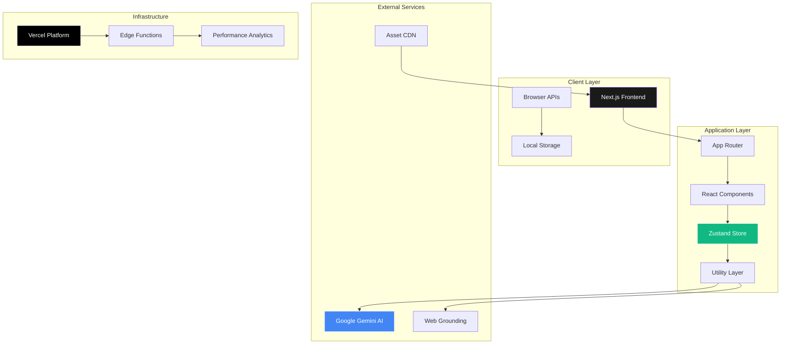
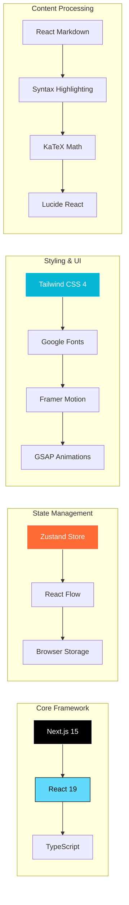
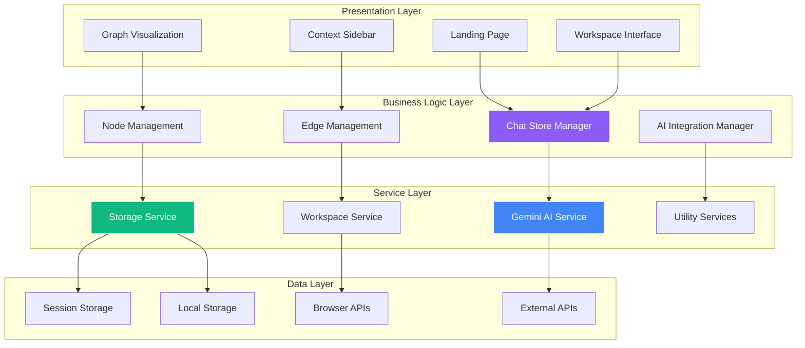
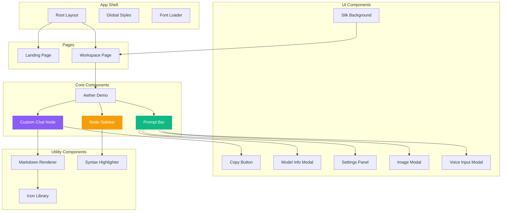
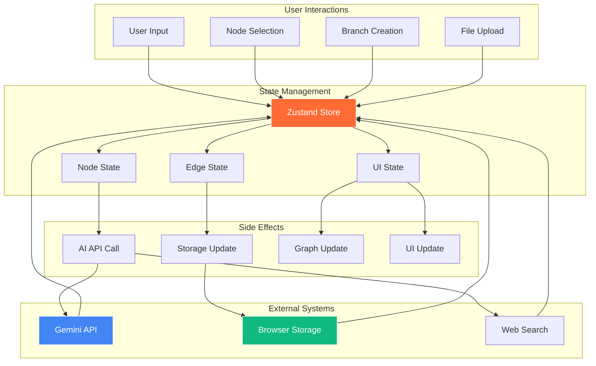
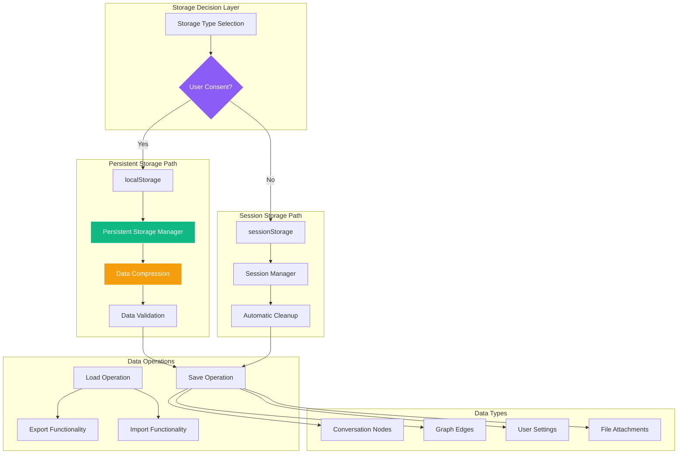
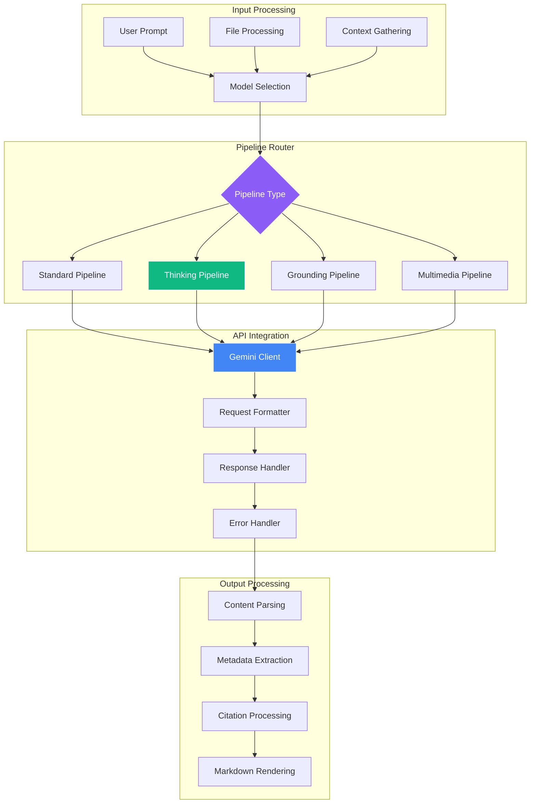
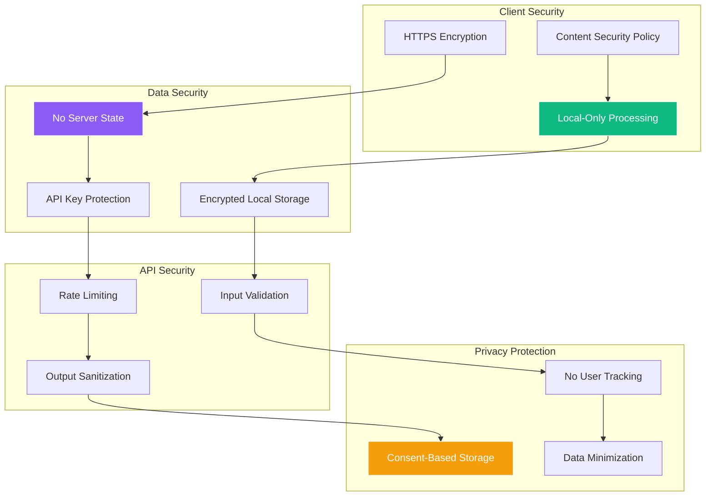
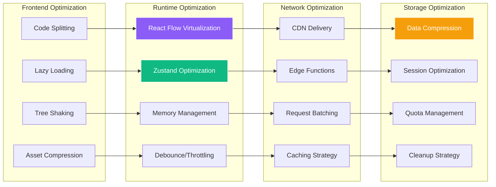
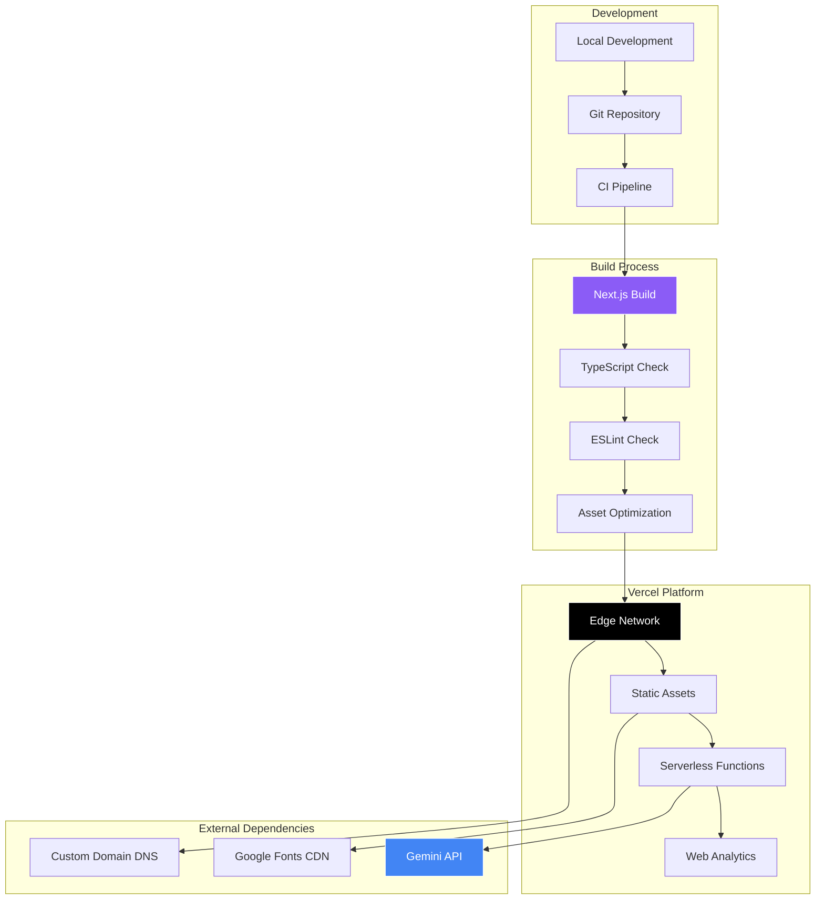

# Aether AI - Technical Architecture Guide

<link rel="preconnect" href="https://fonts.googleapis.com">
<link rel="preconnect" href="https://fonts.gstatic.com" crossorigin>
<link href="https://fonts.googleapis.com/css2?family=Major+Mono+Display&family=Space+Grotesk:wght@300..700&display=swap" rel="stylesheet">

  

    
    <h1 style="font-family: 'Major Mono Display', monospace; font-size: 32px; margin: 0; color: #333;">Architecture Guide</h1>
  

This document provides a comprehensive technical overview of the Aether AI Chat Multiverse architecture, covering system design, component relationships, data flows, and infrastructure patterns.

## Table of Contents

- [System Overview](#system-overview)
- [Architecture Principles](#architecture-principles)
- [Tech Stack](#tech-stack)
- [System Architecture](#system-architecture)
- [Component Architecture](#component-architecture)
- [Data Flow](#data-flow)
- [Storage Architecture](#storage-architecture)
- [AI Pipeline Architecture](#ai-pipeline-architecture)
- [Security Architecture](#security-architecture)
- [Performance Architecture](#performance-architecture)
- [Deployment Architecture](#deployment-architecture)

## System Overview

Aether AI is a modern web application built on Next.js that transforms traditional linear AI conversations into visual, explorable conversation trees. The system enables users to branch conversations at any point, creating a multiverse of dialogue possibilities while maintaining full context and state persistence.

## Architecture Principles

### 1. **Client-First Architecture**
- All processing happens in the browser
- No server-side state management
- Privacy-preserving local storage
- Offline-capable design patterns

### 2. **Component-Driven Design**
- Modular, reusable React components
- Clear separation of concerns
- TypeScript for type safety
- Functional programming patterns

### 3. **Graph-Based Data Model**
- Conversations as directed acyclic graphs (DAGs)
- Nodes represent conversation states
- Edges represent conversation flow
- Immutable state updates

### 4. **Progressive Enhancement**
- Core functionality without JavaScript
- Enhanced features with full interactivity
- Graceful degradation patterns
- Mobile-first responsive design

## Tech Stack

### Frontend Technologies

### Development Stack

| Category | Technology | Version | Purpose |
|----------|------------|---------|---------|
| **Runtime** | Node.js | 18+ | Development environment |
| **Package Manager** | npm | Latest | Dependency management |
| **Framework** | Next.js | 15.3.3 | React framework with SSR |
| **Language** | TypeScript | 5.x | Type-safe development |
| **Build Tool** | Next.js Build | Built-in | Production optimization |
| **Linting** | ESLint | Built-in | Code quality enforcement |

### AI & External Services

| Service | Provider | Purpose | Integration |
|---------|----------|---------|-------------|
| **AI Models** | Google Gemini | Text generation, reasoning | REST API |
| **Web Search** | Google Search | Grounded responses | Gemini Grounding |
| **Image Generation** | Gemini Flash | Visual content creation | API calls |
| **Font Delivery** | Google Fonts | Typography | CDN |
| **Hosting** | Vercel | Deployment platform | Git integration |

## System Architecture

The system follows a layered architecture pattern with clear separation between presentation, business logic, and data layers:

## Component Architecture

The application is built using a component hierarchy that promotes reusability and maintainability:

### Component Responsibilities

| Component | Purpose | Key Features |
|-----------|---------|--------------|
| **CustomChatNode** | Individual conversation nodes | Message display, branching, actions |
| **NodeSidebar** | Context and history panel | Thread view, document context, navigation |
| **PromptBar** | User input interface | Model selection, file upload, settings |
| **AetherDemo** | Main workspace orchestrator | Graph management, node coordination |
| **SettingsPanel** | Configuration interface | Model settings, preferences, export |

## Data Flow

The application implements unidirectional data flow with reactive state updates:

### Data Flow Patterns

1. **User Action → Store Update → Side Effect → Store Update**
2. **API Response → Store Update → UI Re-render**
3. **Storage Change → Store Hydration → UI Sync**
4. **Graph Manipulation → Store Update → Persistence**

## Storage Architecture

The application implements a sophisticated storage system with user consent and automatic persistence:

### Storage Features

- **Consent-Based Persistence**: User explicitly opts into persistent storage
- **Automatic Compression**: Large datasets compressed automatically
- **Data Validation**: Integrity checks on load/save operations
- **Export/Import**: Full workspace backup and restore capabilities
- **Quota Management**: Storage limit monitoring and cleanup
- **Migration Support**: Backward compatibility with version updates

## AI Pipeline Architecture

The AI integration follows a pipeline pattern for different model types and capabilities:

### AI Model Types

| Model Type | Features | Use Cases |
|------------|----------|-----------|
| **Gemini 2.5 Flash** | Fast responses, thinking mode | General conversation, reasoning |
| **Gemini Flash Web** | Web grounding, citations | Research, fact-checking |
| **Multimedia Models** | Image/audio processing | Media analysis, generation |
| **Thinking Models** | Step-by-step reasoning | Complex problem solving |

## Security Architecture

Security is implemented through multiple layers of protection:

## Performance Architecture

Performance optimization is achieved through multiple strategies:

## Deployment Architecture

The application is deployed using a modern, serverless architecture:

### Deployment Features

- **Automatic Deployment**: Git push triggers build and deployment
- **Edge Distribution**: Global CDN for optimal performance
- **Zero-Downtime Deployment**: Blue-green deployment strategy
- **Environment Management**: Separate staging and production environments
- **Custom Domain**: SSL-enabled custom domain configuration
- **Performance Monitoring**: Real-time analytics and monitoring

---

## Related Documentation

- [Development Guide](./DEVELOPMENT.md) - Developer setup and workflow
- [Component Reference](./COMPONENTS.md) - Component API documentation  
- [API Reference](./API.md) - External API integration guide
- [User Guide](./USER_GUIDE.md) - End-user documentation
- [Deployment Guide](./DEPLOYMENT.md) - Production deployment guide

---

  

    For technical questions about the architecture, please 
    <a href="https://github.com/sbeeredd04/Aether/issues">open an issue</a> 
    or contact the development team.
  

