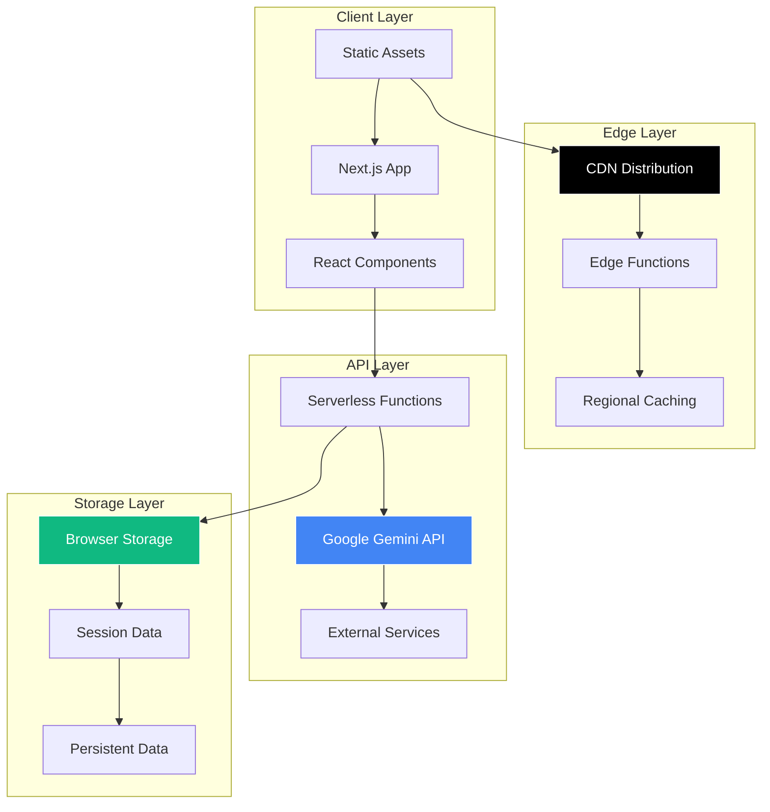

# Aether AI - Deployment Guide

<link rel="preconnect" href="https://fonts.googleapis.com">
<link rel="preconnect" href="https://fonts.gstatic.com" crossorigin>
<link href="https://fonts.googleapis.com/css2?family=Major+Mono+Display&family=Space+Grotesk:wght@300..700&display=swap" rel="stylesheet">

<div align="center">
  <div style="display: flex; align-items: center; justify-content: center; gap: 15px; margin-bottom: 20px;">
    
    <h1 style="font-family: 'Major Mono Display', monospace; font-size: 32px; margin: 0; color: #333;">Deployment Guide</h1>
  </div>
</div>

Comprehensive guide for deploying Aether AI to production environments. From simple cloud deployments to complex enterprise setups.

## Table of Contents

- [Deployment Overview](#deployment-overview)
- [Vercel Deployment](#vercel-deployment)
- [Netlify Deployment](#netlify-deployment)
- [AWS Deployment](#aws-deployment)
- [Docker Deployment](#docker-deployment)
- [Self-Hosted Solutions](#self-hosted-solutions)
- [Environment Configuration](#environment-configuration)
- [Performance Optimization](#performance-optimization)
- [Security Considerations](#security-considerations)
- [Monitoring and Maintenance](#monitoring-and-maintenance)
- [Troubleshooting](#troubleshooting)

## Deployment Overview

### Architecture Pattern

Aether AI follows a **JAMstack architecture** optimized for serverless deployment:



### Deployment Options Comparison

| Platform | Complexity | Cost | Scalability | Performance | Best For |
|----------|------------|------|-------------|-------------|----------|
| **Vercel** | ⭐ | Free/Paid | ⭐⭐⭐ | ⭐⭐⭐ | Quick deployment, CI/CD |
| **Netlify** | ⭐ | Free/Paid | ⭐⭐⭐ | ⭐⭐⭐ | Static sites, forms |
| **AWS** | ⭐⭐⭐ | Pay-as-go | ⭐⭐⭐ | ⭐⭐⭐ | Enterprise, custom needs |
| **Docker** | ⭐⭐ | Variable | ⭐⭐ | ⭐⭐ | On-premise, hybrid cloud |
| **Self-Hosted** | ⭐⭐⭐ | Fixed | ⭐ | ⭐⭐ | Full control, compliance |

## Vercel Deployment

### Quick Deploy (Recommended)

**One-Click Deployment:**

[](https://vercel.com/new/clone?repository-url=https://github.com/sbeeredd04/Aether)

**Manual GitHub Integration:**
1. Fork the [Aether repository](https://github.com/sbeeredd04/Aether)
2. Sign up for [Vercel](https://vercel.com)
3. Click "New Project" → Import Git Repository
4. Select your forked repository
5. Configure environment variables
6. Deploy!

### CLI Deployment

```bash
# Install Vercel CLI
npm install -g vercel

# Login to Vercel
vercel login

# Navigate to project directory
cd Aether/aether

# Deploy
vercel

# Follow prompts:
# ? Set up and deploy "~/Aether/aether"? [Y/n] y
# ? Which scope do you want to deploy to? (your-team)
# ? Link to existing project? [y/N] n
# ? What's your project's name? aether
# ? In which directory is your code located? ./
```

### Environment Variables Setup

**Via Vercel Dashboard:**
1. Go to Project → Settings → Environment Variables
2. Add required variables:

```env
GOOGLE_AI_API_KEY=your_production_api_key
NEXT_PUBLIC_APP_NAME=Aether
NEXT_PUBLIC_APP_VERSION=1.0.0
```

**Via CLI:**
```bash
# Add environment variables
vercel env add GOOGLE_AI_API_KEY
# Enter the value when prompted

# List environment variables
vercel env ls

# Remove environment variable
vercel env rm GOOGLE_AI_API_KEY
```

### Custom Domain Setup

**Add Custom Domain:**
```bash
# Add domain via CLI
vercel domains add yourdomain.com

# Verify domain
vercel domains verify yourdomain.com

# Link to project
vercel alias set your-app-url.vercel.app yourdomain.com
```

**DNS Configuration:**
```text
# Add these DNS records to your domain provider:
Type: CNAME
Name: www
Value: cname.vercel-dns.com

Type: A
Name: @
Value: 76.76.19.19
```

### Automatic Deployments

**Branch Configuration:**
```json
{
  "git": {
    "deploymentEnabled": {
      "main": true,
      "staging": true
    }
  },
  "github": {
    "autoAlias": false
  }
}
```

**Deployment Hooks:**
```bash
# Add to .github/workflows/deploy.yml
name: Deploy to Vercel
on:
  push:
    branches: [main]
jobs:
  deploy:
    runs-on: ubuntu-latest
    steps:
      - uses: actions/checkout@v2
      - name: Deploy to Vercel
        uses: amondnet/vercel-action@v20
        with:
          vercel-token: ${{ secrets.VERCEL_TOKEN }}
          vercel-org-id: ${{ secrets.ORG_ID }}
          vercel-project-id: ${{ secrets.PROJECT_ID }}
```

## Netlify Deployment

### Direct Git Deployment

1. **Connect Repository:**
   - Sign up for [Netlify](https://netlify.com)
   - Click "New site from Git"
   - Choose GitHub and authorize
   - Select Aether repository

2. **Build Configuration:**
   ```toml
   # netlify.toml
   [build]
     publish = "aether/.next"
     command = "cd aether && npm run build"
   
   [build.environment]
     NODE_VERSION = "18"
     NPM_VERSION = "9"
   
   [[redirects]]
     from = "/*"
     to = "/index.html"
     status = 200
   ```

3. **Environment Variables:**
   - Go to Site Settings → Environment Variables
   - Add `GOOGLE_AI_API_KEY`

### CLI Deployment

```bash
# Install Netlify CLI
npm install -g netlify-cli

# Login
netlify login

# Initialize site
netlify init

# Deploy
netlify deploy

# Deploy to production
netlify deploy --prod
```

### Form Handling (Bonus Feature)

```html
<!-- Add contact form with Netlify Forms -->
<form name="contact" netlify>
  <input type="hidden" name="form-name" value="contact" />
  <input type="email" name="email" placeholder="Your email" />
  <textarea name="message" placeholder="Feedback"></textarea>
  <button type="submit">Send</button>
</form>
```

## AWS Deployment

### AWS Amplify

**Deploy with Amplify:**
```bash
# Install AWS CLI and Amplify CLI
npm install -g @aws-amplify/cli

# Configure AWS credentials
amplify configure

# Initialize Amplify project
cd Aether/aether
amplify init

# Add hosting
amplify add hosting
# Choose: Amazon CloudFront and S3

# Deploy
amplify publish
```

**Amplify Configuration:**
```yaml
# amplify.yml
version: 1
frontend:
  phases:
    preBuild:
      commands:
        - cd aether
        - npm ci
    build:
      commands:
        - npm run build
  artifacts:
    baseDirectory: aether/.next
    files:
      - '**/*'
  cache:
    paths:
      - aether/node_modules/**/*
```

### EC2 with Load Balancer

**Infrastructure Setup:**
```bash
# Launch EC2 instance
aws ec2 run-instances \
  --image-id ami-0abcdef1234567890 \
  --count 1 \
  --instance-type t3.micro \
  --key-name your-key-pair \
  --security-group-ids sg-903004f8 \
  --subnet-id subnet-6e7f829e

# Create Application Load Balancer
aws elbv2 create-load-balancer \
  --name aether-alb \
  --subnets subnet-12345678 subnet-87654321 \
  --security-groups sg-12345678
```

**Deployment Script:**
```bash
#!/bin/bash
# deploy-to-ec2.sh

# Update system
sudo yum update -y

# Install Node.js
curl -fsSL https://rpm.nodesource.com/setup_18.x | sudo bash -
sudo yum install -y nodejs

# Install PM2
sudo npm install -g pm2

# Clone repository
git clone https://github.com/sbeeredd04/Aether.git
cd Aether/aether

# Install dependencies
npm ci --only=production

# Build application
npm run build

# Start with PM2
pm2 start npm --name "aether" -- start
pm2 startup
pm2 save

# Configure Nginx
sudo yum install -y nginx
sudo systemctl start nginx
sudo systemctl enable nginx
```

### S3 + CloudFront

**Build and Deploy:**
```bash
# Build for static export
npm run build

# Upload to S3
aws s3 sync .next/static s3://your-bucket-name/static
aws s3 sync .next/server s3://your-bucket-name/server

# Invalidate CloudFront cache
aws cloudfront create-invalidation \
  --distribution-id YOUR_DISTRIBUTION_ID \
  --paths "/*"
```

## Docker Deployment

### Multi-Stage Dockerfile

```dockerfile
# Build stage
FROM node:18-alpine AS builder

WORKDIR /app
COPY package*.json ./
RUN npm ci --only=production && npm cache clean --force

COPY . .
RUN npm run build

# Production stage
FROM node:18-alpine AS runner

WORKDIR /app

# Create non-root user
RUN addgroup --system --gid 1001 nodejs
RUN adduser --system --uid 1001 nextjs

# Copy built application
COPY --from=builder /app/public ./public
COPY --from=builder /app/.next/standalone ./
COPY --from=builder /app/.next/static ./.next/static

# Set permissions
USER nextjs

EXPOSE 3000

# Start application
CMD ["node", "server.js"]
```

### Docker Compose Production

```yaml
version: '3.8'

services:
  aether:
    build:
      context: .
      dockerfile: Dockerfile
    ports:
      - "3000:3000"
    environment:
      - GOOGLE_AI_API_KEY=${GOOGLE_AI_API_KEY}
      - NODE_ENV=production
    restart: unless-stopped
    healthcheck:
      test: ["CMD", "curl", "-f", "http://localhost:3000/api/health"]
      interval: 30s
      timeout: 10s
      retries: 3

  nginx:
    image: nginx:alpine
    ports:
      - "80:80"
      - "443:443"
    volumes:
      - ./nginx.conf:/etc/nginx/nginx.conf:ro
      - ./ssl:/etc/nginx/ssl:ro
    depends_on:
      - aether
    restart: unless-stopped

  redis:
    image: redis:alpine
    ports:
      - "6379:6379"
    restart: unless-stopped
    command: redis-server --appendonly yes
    volumes:
      - redis_data:/data

volumes:
  redis_data:
```

### Kubernetes Deployment

```yaml
# k8s-deployment.yaml
apiVersion: apps/v1
kind: Deployment
metadata:
  name: aether-deployment
spec:
  replicas: 3
  selector:
    matchLabels:
      app: aether
  template:
    metadata:
      labels:
        app: aether
    spec:
      containers:
      - name: aether
        image: your-registry/aether:latest
        ports:
        - containerPort: 3000
        env:
        - name: GOOGLE_AI_API_KEY
          valueFrom:
            secretKeyRef:
              name: aether-secrets
              key: google-ai-api-key
        resources:
          requests:
            memory: "256Mi"
            cpu: "250m"
          limits:
            memory: "512Mi"
            cpu: "500m"

---
apiVersion: v1
kind: Service
metadata:
  name: aether-service
spec:
  selector:
    app: aether
  ports:
  - protocol: TCP
    port: 80
    targetPort: 3000
  type: LoadBalancer
```

## Self-Hosted Solutions

### VPS Deployment

**Ubuntu Server Setup:**
```bash
# Update system
sudo apt update && sudo apt upgrade -y

# Install Node.js
curl -fsSL https://deb.nodesource.com/setup_18.x | sudo -E bash -
sudo apt-get install -y nodejs

# Install Nginx
sudo apt install nginx -y

# Install PM2
sudo npm install -g pm2

# Configure firewall
sudo ufw allow ssh
sudo ufw allow 'Nginx Full'
sudo ufw enable

# Clone and setup application
git clone https://github.com/sbeeredd04/Aether.git
cd Aether/aether
npm install
npm run build

# Start with PM2
pm2 start npm --name aether -- start
pm2 startup
pm2 save
```

**Nginx Configuration:**
```nginx
# /etc/nginx/sites-available/aether
server {
    listen 80;
    server_name your-domain.com www.your-domain.com;
    
    location / {
        proxy_pass http://localhost:3000;
        proxy_http_version 1.1;
        proxy_set_header Upgrade $http_upgrade;
        proxy_set_header Connection 'upgrade';
        proxy_set_header Host $host;
        proxy_set_header X-Real-IP $remote_addr;
        proxy_set_header X-Forwarded-For $proxy_add_x_forwarded_for;
        proxy_set_header X-Forwarded-Proto $scheme;
        proxy_cache_bypass $http_upgrade;
        proxy_read_timeout 86400;
    }
    
    # Gzip compression
    gzip on;
    gzip_types
        text/plain
        text/css
        text/js
        text/xml
        text/javascript
        application/javascript
        application/xml+rss;
    
    # Static file caching
    location /_next/static {
        alias /path/to/aether/.next/static;
        expires 365d;
        access_log off;
    }
}

# Enable site
sudo ln -s /etc/nginx/sites-available/aether /etc/nginx/sites-enabled/
sudo nginx -t
sudo systemctl reload nginx
```

### SSL/TLS Setup with Let's Encrypt

```bash
# Install Certbot
sudo apt install certbot python3-certbot-nginx

# Obtain SSL certificate
sudo certbot --nginx -d your-domain.com -d www.your-domain.com

# Verify auto-renewal
sudo certbot renew --dry-run

# Add to crontab for automatic renewal
echo "0 12 * * * /usr/bin/certbot renew --quiet" | sudo crontab -
```

## Environment Configuration

### Production Environment Variables

```env
# Production .env.local
GOOGLE_AI_API_KEY=your_production_api_key
NODE_ENV=production
NEXT_PUBLIC_APP_NAME=Aether
NEXT_PUBLIC_APP_VERSION=1.0.0

# Optional: Analytics
NEXT_PUBLIC_GA_ID=G-XXXXXXXXXX
NEXT_PUBLIC_HOTJAR_ID=your_hotjar_id

# Optional: Error Tracking
SENTRY_DSN=your_sentry_dsn
SENTRY_ORG=your_org
SENTRY_PROJECT=your_project

# Optional: Performance Monitoring
VERCEL_ANALYTICS_ID=your_analytics_id
```

### Security Environment Variables

```env
# Security configurations
NEXTAUTH_SECRET=your_auth_secret
NEXTAUTH_URL=https://your-domain.com

# API Rate Limiting
API_RATE_LIMIT=100
API_RATE_WINDOW=3600

# CORS Configuration
ALLOWED_ORIGINS=https://your-domain.com,https://www.your-domain.com
```

### Environment-Specific Configuration

```javascript
// next.config.js
const nextConfig = {
  env: {
    CUSTOM_KEY: process.env.CUSTOM_KEY,
  },
  async headers() {
    return [
      {
        source: '/(.*)',
        headers: [
          {
            key: 'X-Frame-Options',
            value: 'DENY',
          },
          {
            key: 'X-Content-Type-Options',
            value: 'nosniff',
          },
          {
            key: 'Referrer-Policy',
            value: 'origin-when-cross-origin',
          },
        ],
      },
    ];
  },
  async redirects() {
    return [
      {
        source: '/old-path',
        destination: '/new-path',
        permanent: true,
      },
    ];
  },
};

module.exports = nextConfig;
```

## Performance Optimization

### Build Optimization

```javascript
// next.config.js optimizations
const nextConfig = {
  // Enable SWC minification
  swcMinify: true,
  
  // Optimize images
  images: {
    formats: ['image/webp', 'image/avif'],
    deviceSizes: [640, 750, 828, 1080, 1200, 1920, 2048, 3840],
  },
  
  // Enable experimental features
  experimental: {
    optimizeCss: true,
    optimizePackageImports: ['lucide-react'],
  },
  
  // Webpack optimizations
  webpack: (config, { dev, isServer }) => {
    if (!dev && !isServer) {
      config.optimization.splitChunks.chunks = 'all';
    }
    return config;
  },
};
```

### CDN Configuration

**CloudFront Distribution:**
```json
{
  "DistributionConfig": {
    "CallerReference": "aether-cdn",
    "Origins": [
      {
        "Id": "aether-origin",
        "DomainName": "your-app.vercel.app",
        "CustomOriginConfig": {
          "HTTPPort": 443,
          "OriginProtocolPolicy": "https-only"
        }
      }
    ],
    "DefaultCacheBehavior": {
      "TargetOriginId": "aether-origin",
      "ViewerProtocolPolicy": "redirect-to-https",
      "CachePolicyId": "optimized-caching-policy"
    }
  }
}
```

### Database Optimization (if applicable)

```sql
-- PostgreSQL optimizations
CREATE INDEX CONCURRENTLY idx_user_sessions ON user_sessions(user_id, created_at);
CREATE INDEX CONCURRENTLY idx_conversation_nodes ON conversations(node_id, updated_at);

-- Connection pooling
ALTER SYSTEM SET max_connections = 200;
ALTER SYSTEM SET shared_buffers = '256MB';
ALTER SYSTEM SET effective_cache_size = '1GB';
```

## Security Considerations

### Security Headers

```javascript
// Security headers in next.config.js
const securityHeaders = [
  {
    key: 'Content-Security-Policy',
    value: `
      default-src 'self';
      script-src 'self' 'unsafe-eval' 'unsafe-inline' *.vercel.app;
      style-src 'self' 'unsafe-inline' fonts.googleapis.com;
      img-src 'self' data: blob: *.vercel.app;
      font-src 'self' fonts.gstatic.com;
      connect-src 'self' *.googleapis.com *.google.com;
      frame-ancestors 'none';
    `.replace(/\s{2,}/g, ' ').trim()
  },
  {
    key: 'X-Frame-Options',
    value: 'DENY'
  },
  {
    key: 'X-Content-Type-Options',
    value: 'nosniff'
  },
  {
    key: 'Referrer-Policy',
    value: 'origin-when-cross-origin'
  }
];
```

### API Key Security

```javascript
// API key validation
const validateApiKey = (req, res, next) => {
  const apiKey = req.headers['x-api-key'];
  
  if (!apiKey || !isValidApiKey(apiKey)) {
    return res.status(401).json({ error: 'Invalid API key' });
  }
  
  next();
};

// Rate limiting
const rateLimit = require('express-rate-limit');
const limiter = rateLimit({
  windowMs: 15 * 60 * 1000, // 15 minutes
  max: 100, // limit each IP to 100 requests per windowMs
  message: 'Too many requests from this IP'
});
```

### Environment Security

```bash
# Set proper file permissions
chmod 600 .env.local
chown root:root .env.local

# Use secrets management
kubectl create secret generic aether-secrets \
  --from-literal=google-ai-api-key='your-api-key'

# Rotate secrets regularly
gcloud secrets versions add google-ai-api-key --data-file=new-key.txt
```

## Monitoring and Maintenance

### Health Checks

```javascript
// pages/api/health.js
export default function handler(req, res) {
  const health = {
    status: 'healthy',
    timestamp: new Date().toISOString(),
    version: process.env.NEXT_PUBLIC_APP_VERSION,
    uptime: process.uptime(),
    memory: process.memoryUsage(),
  };
  
  res.status(200).json(health);
}
```

### Logging Configuration

```javascript
// utils/logger.js
const winston = require('winston');

const logger = winston.createLogger({
  level: process.env.LOG_LEVEL || 'info',
  format: winston.format.combine(
    winston.format.timestamp(),
    winston.format.errors({ stack: true }),
    winston.format.json()
  ),
  transports: [
    new winston.transports.File({ filename: 'error.log', level: 'error' }),
    new winston.transports.File({ filename: 'combined.log' }),
  ],
});

if (process.env.NODE_ENV !== 'production') {
  logger.add(new winston.transports.Console({
    format: winston.format.simple()
  }));
}

module.exports = logger;
```

### Monitoring Setup

**Application Monitoring:**
```javascript
// Sentry integration
import * as Sentry from '@sentry/nextjs';

Sentry.init({
  dsn: process.env.SENTRY_DSN,
  environment: process.env.NODE_ENV,
  tracesSampleRate: 1.0,
});
```

**Infrastructure Monitoring:**
```yaml
# docker-compose.monitoring.yml
version: '3.8'

services:
  prometheus:
    image: prom/prometheus
    ports:
      - "9090:9090"
    volumes:
      - ./prometheus.yml:/etc/prometheus/prometheus.yml
  
  grafana:
    image: grafana/grafana
    ports:
      - "3001:3000"
    environment:
      - GF_SECURITY_ADMIN_PASSWORD=admin
    volumes:
      - grafana_data:/var/lib/grafana

volumes:
  grafana_data:
```

### Backup Strategies

```bash
# Database backup (if applicable)
pg_dump -h localhost -U postgres aether_db > backup_$(date +%Y%m%d_%H%M%S).sql

# File system backup
tar -czf aether_backup_$(date +%Y%m%d).tar.gz /path/to/aether

# S3 backup
aws s3 sync /path/to/aether s3://aether-backups/$(date +%Y%m%d)/
```

## Troubleshooting

### Common Deployment Issues

**Build Failures:**
```bash
# Clear cache and reinstall
rm -rf .next node_modules package-lock.json
npm install
npm run build

# Check Node.js version
node --version  # Should be 18+

# Increase memory limit
export NODE_OPTIONS="--max-old-space-size=4096"
npm run build
```

**Environment Variable Issues:**
```bash
# Check if variables are loaded
node -e "console.log(process.env.GOOGLE_AI_API_KEY)"

# Verify in production
curl -H "Authorization: Bearer $VERCEL_TOKEN" \
  "https://api.vercel.com/v1/projects/$PROJECT_ID/env"
```

**Performance Issues:**
```bash
# Analyze bundle size
npm install -g @next/bundle-analyzer
ANALYZE=true npm run build

# Check memory usage
docker stats aether

# Monitor response times
curl -w "@curl-format.txt" -o /dev/null https://your-domain.com
```

### Rollback Procedures

**Vercel Rollback:**
```bash
# List deployments
vercel ls

# Rollback to previous deployment
vercel rollback your-deployment-url.vercel.app
```

**Docker Rollback:**
```bash
# Tag current version before deployment
docker tag aether:latest aether:backup

# Rollback if needed
docker stop aether
docker run -d --name aether aether:backup
```

**Database Rollback (if applicable):**
```bash
# Restore from backup
pg_restore -h localhost -U postgres -d aether_db backup_20231201_120000.sql
```

---

## Deployment Checklist

### Pre-Deployment
- [ ] All tests passing
- [ ] Build successful locally
- [ ] Environment variables configured
- [ ] API keys validated
- [ ] Security headers configured
- [ ] SSL/TLS certificate ready

### Deployment
- [ ] Deploy to staging first
- [ ] Run smoke tests
- [ ] Verify all functionality
- [ ] Check performance metrics
- [ ] Monitor error rates
- [ ] Verify SSL/TLS works

### Post-Deployment
- [ ] Monitor application logs
- [ ] Check error tracking
- [ ] Verify analytics working
- [ ] Test backup procedures
- [ ] Update documentation
- [ ] Notify stakeholders

---

<div align="center">
  <p style="font-family: 'Space Grotesk', sans-serif;">
    Ready for production? Your <span style="font-family: 'Major Mono Display', monospace;">Aether</span> deployment awaits!
    <br>
    For deployment support, <a href="https://github.com/sbeeredd04/Aether/issues">open an issue</a> on GitHub.
  </p>
</div>