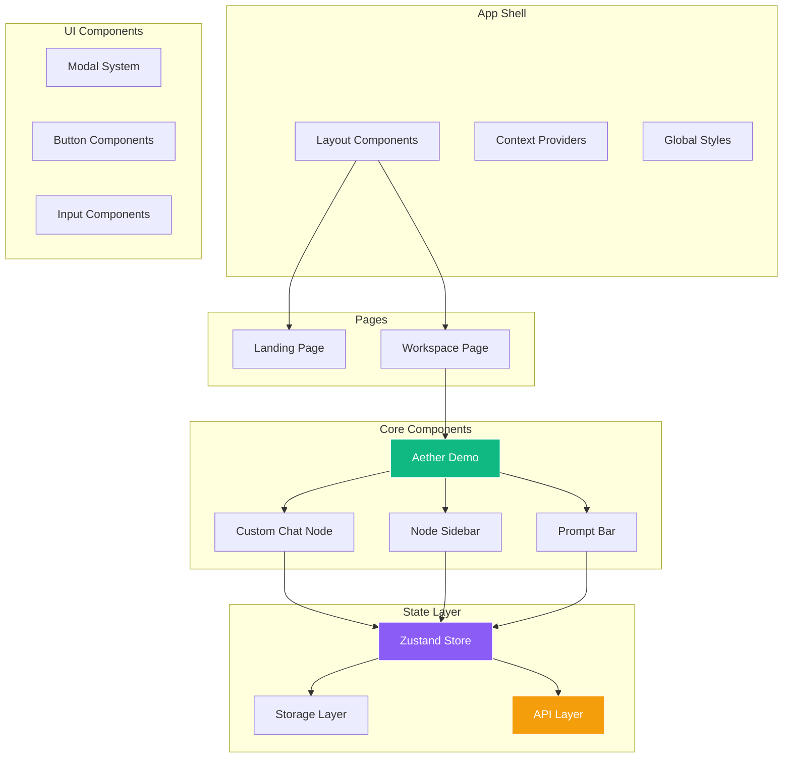
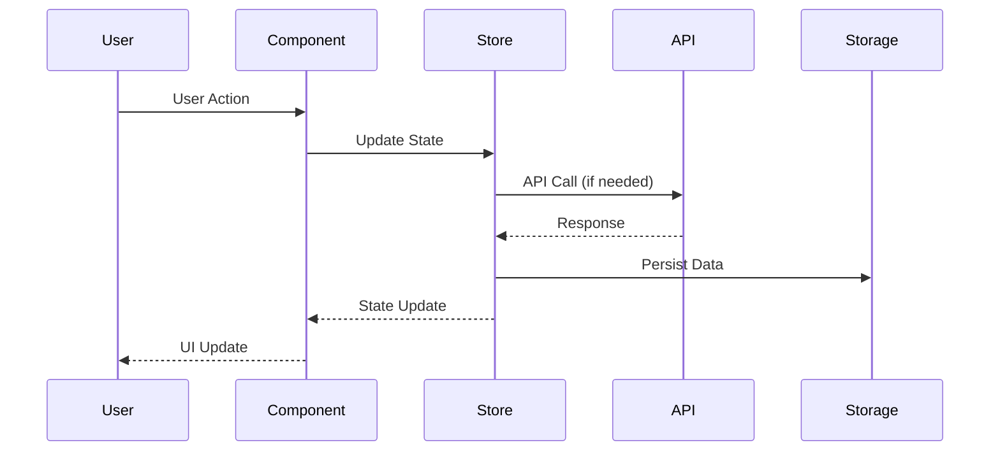

# Aether AI - Development Guide

<link rel="preconnect" href="https://fonts.googleapis.com">
<link rel="preconnect" href="https://fonts.gstatic.com" crossorigin>
<link href="https://fonts.googleapis.com/css2?family=Major+Mono+Display&family=Space+Grotesk:wght@300..700&display=swap" rel="stylesheet">

<div align="center">
  <div style="display: flex; align-items: center; justify-content: center; gap: 15px; margin-bottom: 20px;">
    
    <h1 style="font-family: 'Major Mono Display', monospace; font-size: 32px; margin: 0; color: #333;">Development Guide</h1>
  </div>
</div>

Comprehensive guide for developers contributing to Aether AI. This document covers setup, architecture, coding standards, and contribution workflows.

## Table of Contents

- [Quick Start](#quick-start)
- [Development Environment](#development-environment)
- [Project Structure](#project-structure)
- [Architecture Overview](#architecture-overview)
- [Coding Standards](#coding-standards)
- [Component Development](#component-development)
- [State Management](#state-management)
- [API Integration](#api-integration)
- [Testing Guidelines](#testing-guidelines)
- [Performance Optimization](#performance-optimization)
- [Debugging & Troubleshooting](#debugging--troubleshooting)
- [Contribution Workflow](#contribution-workflow)

## Quick Start

### Prerequisites

Ensure you have the following installed:

| Tool | Version | Purpose |
|------|---------|---------|
| **Node.js** | 18+ | Runtime environment |
| **npm** | 9+ | Package manager |
| **Git** | Latest | Version control |
| **VS Code** | Latest | Recommended editor |

### Initial Setup

```bash
# Clone the repository
git clone https://github.com/sbeeredd04/Aether.git
cd Aether/aether

# Install dependencies
npm install

# Set up environment variables
cp .env.example .env.local

# Add your API keys to .env.local
echo "GOOGLE_AI_API_KEY=your_gemini_api_key_here" >> .env.local

# Start development server
npm run dev
```

Open [http://localhost:3000](http://localhost:3000) to view the application.

## Development Environment

### Recommended VS Code Extensions

```json
{
  "recommendations": [
    "bradlc.vscode-tailwindcss",
    "ms-vscode.vscode-typescript-next",
    "esbenp.prettier-vscode",
    "ms-vscode.vscode-eslint",
    "formulahendry.auto-rename-tag",
    "christian-kohler.path-intellisense"
  ]
}
```

### Editor Configuration

Create `.vscode/settings.json`:

```json
{
  "editor.formatOnSave": true,
  "editor.defaultFormatter": "esbenp.prettier-vscode",
  "editor.codeActionsOnSave": {
    "source.fixAll.eslint": "always"
  },
  "typescript.preferences.importModuleSpecifier": "relative",
  "tailwindCSS.experimental.classRegex": [
    ["clsx\\(([^)]*)\\)", "(?:'|\"|`)([^']*)(?:'|\"|`)"]
  ]
}
```

### Development Scripts

| Command | Purpose | Usage |
|---------|---------|-------|
| `npm run dev` | Start development server | Hot reload, debugging |
| `npm run build` | Production build | Test deployment readiness |
| `npm run start` | Production server | Test built application |
| `npm run lint` | ESLint check | Code quality validation |
| `npm run lint:fix` | Fix linting issues | Automatic corrections |
| `npm run type-check` | TypeScript validation | Type safety check |

## Project Structure

### Directory Organization

```
aether/
├── src/
│   ├── app/                    # Next.js App Router
│   │   ├── globals.css        # Global styles
│   │   ├── layout.tsx         # Root layout
│   │   ├── page.tsx          # Landing page
│   │   ├── workspace/        # Main application
│   │   └── api/              # API routes (if needed)
│   ├── components/           # React components
│   │   ├── ui/              # Reusable UI components
│   │   ├── nodes/           # Node-specific components
│   │   ├── modals/          # Modal components
│   │   └── ...              # Feature components
│   ├── store/               # State management
│   │   └── chatStore.ts     # Zustand store
│   ├── utils/               # Utility functions
│   │   ├── gemini.ts        # AI integration
│   │   ├── models.ts        # Model definitions
│   │   ├── storage.ts       # Storage utilities
│   │   └── ...              # Other utilities
│   ├── config/              # Configuration files
│   ├── lib/                 # Shared libraries
│   └── types/               # TypeScript type definitions
├── public/                  # Static assets
├── docs/                   # Documentation
└── ...                     # Config files
```

### File Naming Conventions

| Type | Convention | Example |
|------|------------|---------|
| **Components** | PascalCase | `CustomChatNode.tsx` |
| **Utilities** | camelCase | `geminiClient.ts` |
| **Constants** | UPPER_SNAKE_CASE | `API_ENDPOINTS.ts` |
| **Types** | PascalCase | `ChatMessage.ts` |
| **Hooks** | camelCase with 'use' | `useChat.ts` |

## Architecture Overview

### Component Architecture



### Data Flow Pattern



## Coding Standards

### TypeScript Guidelines

#### Interface Definitions

```typescript
// Good: Clear, descriptive interfaces
interface ChatMessage {
  role: 'user' | 'model';
  content: string;
  attachments?: AttachmentData[];
  modelId?: string;
  timestamp: number;
}

// Good: Proper generic usage
interface ApiResponse<T> {
  data: T;
  success: boolean;
  error?: string;
}
```

#### Component Props

```typescript
// Good: Props interface with JSDoc
interface CustomChatNodeProps {
  /** The node data containing chat history */
  data: CustomNodeData;
  /** Whether the node is currently selected */
  isSelected: boolean;
  /** Callback when node is clicked */
  onNodeClick: (nodeId: string) => void;
  /** Optional custom styling */
  className?: string;
}

// Component implementation
const CustomChatNode: React.FC<CustomChatNodeProps> = ({
  data,
  isSelected,
  onNodeClick,
  className
}) => {
  // Component logic
};
```

#### Error Handling

```typescript
// Good: Comprehensive error handling
const handleApiCall = async (): Promise<ApiResponse<ChatMessage>> => {
  try {
    const response = await geminiClient.generateContent(prompt);
    return { data: response, success: true };
  } catch (error) {
    logger.error('API call failed', { error, prompt });
    return { 
      data: null, 
      success: false, 
      error: error instanceof Error ? error.message : 'Unknown error' 
    };
  }
};
```

### React Component Standards

#### Functional Component Structure

```typescript
import React, { useState, useCallback, useEffect } from 'react';
import { clsx } from 'clsx';
import { SomeUtility } from '../utils/someUtility';

interface ComponentProps {
  // Props definition
}

const ComponentName: React.FC<ComponentProps> = ({ 
  prop1, 
  prop2, 
  className 
}) => {
  // 1. State declarations
  const [state, setState] = useState<StateType>(initialValue);
  
  // 2. Custom hooks
  const { data, loading } = useSomeHook();
  
  // 3. Memoized callbacks
  const handleAction = useCallback((param: string) => {
    // Handler logic
  }, [dependencies]);
  
  // 4. Effects
  useEffect(() => {
    // Effect logic
  }, [dependencies]);
  
  // 5. Conditional early returns
  if (loading) return <LoadingSpinner />;
  if (error) return <ErrorDisplay error={error} />;
  
  // 6. Main render
  return (
    <div className={clsx('default-classes', className)}>
      {/* Component JSX */}
    </div>
  );
};

export default ComponentName;
```

#### Custom Hooks

```typescript
// Good: Reusable custom hook
const useChat = (nodeId: string) => {
  const store = useChatStore();
  
  const sendMessage = useCallback(async (content: string) => {
    try {
      await store.addMessageToNode(nodeId, { 
        role: 'user', 
        content,
        timestamp: Date.now()
      });
      // Trigger AI response
      await store.generateResponse(nodeId);
    } catch (error) {
      logger.error('Failed to send message', { error, nodeId });
    }
  }, [nodeId, store]);
  
  return {
    messages: store.getNodeMessages(nodeId),
    sendMessage,
    isLoading: store.isGenerating
  };
};
```

### Styling Guidelines

#### Tailwind CSS Best Practices

```tsx
// Good: Organized class structure
const ChatNode = ({ isActive, hasError }) => (
  <div 
    className={clsx(
      // Base styles
      'rounded-lg border p-4 transition-all duration-200',
      // State variants
      isActive && 'border-purple-500 shadow-lg',
      !isActive && 'border-gray-700 hover:border-gray-600',
      // Error state
      hasError && 'border-red-500 bg-red-900/10'
    )}
  >
    {/* Content */}
  </div>
);

// Good: Component-specific styles
const nodeStyles = {
  base: 'rounded-lg border p-4 transition-all duration-200',
  active: 'border-purple-500 shadow-lg',
  inactive: 'border-gray-700 hover:border-gray-600',
  error: 'border-red-500 bg-red-900/10'
};
```

## Component Development

### Creating New Components

#### 1. Component Template

```typescript
// src/components/NewComponent.tsx
import React from 'react';
import { clsx } from 'clsx';
import logger from '../utils/logger';

interface NewComponentProps {
  // Define props
}

const NewComponent: React.FC<NewComponentProps> = ({ }) => {
  logger.debug('NewComponent rendered');
  
  return (
    <div className="new-component">
      {/* Component content */}
    </div>
  );
};

export default NewComponent;
```

#### 2. Add to Export Index

```typescript
// src/components/index.ts
export { default as NewComponent } from './NewComponent';
```

#### 3. Component Documentation

```typescript
/**
 * NewComponent - Brief description
 * 
 * @example
 * ```tsx
 * <NewComponent prop="value" />
 * ```
 */
const NewComponent: React.FC<NewComponentProps> = ({ }) => {
  // Implementation
};
```

### Component Testing

```typescript
// src/components/__tests__/NewComponent.test.tsx
import { render, screen } from '@testing-library/react';
import userEvent from '@testing-library/user-event';
import NewComponent from '../NewComponent';

describe('NewComponent', () => {
  it('renders correctly', () => {
    render(<NewComponent />);
    expect(screen.getByText('Expected text')).toBeInTheDocument();
  });
  
  it('handles user interaction', async () => {
    const user = userEvent.setup();
    const mockHandler = jest.fn();
    
    render(<NewComponent onAction={mockHandler} />);
    
    await user.click(screen.getByRole('button'));
    expect(mockHandler).toHaveBeenCalledWith(expectedArgs);
  });
});
```

## State Management

### Zustand Store Patterns

#### Store Structure

```typescript
// src/store/chatStore.ts
interface ChatState {
  // State properties
  nodes: Node<CustomNodeData>[];
  edges: Edge[];
  activeNodeId: string | null;
  
  // Actions
  addNode: (node: Node<CustomNodeData>) => void;
  updateNode: (nodeId: string, updates: Partial<CustomNodeData>) => void;
  deleteNode: (nodeId: string) => void;
  
  // Async actions
  generateResponse: (nodeId: string) => Promise<void>;
  saveToStorage: () => Promise<void>;
}

const useChatStore = create<ChatState>((set, get) => ({
  // Initial state
  nodes: [],
  edges: [],
  activeNodeId: null,
  
  // Synchronous actions
  addNode: (node) => set((state) => ({
    nodes: [...state.nodes, node]
  })),
  
  // Async actions
  generateResponse: async (nodeId) => {
    const { nodes } = get();
    const node = nodes.find(n => n.id === nodeId);
    
    if (!node) return;
    
    try {
      const response = await geminiClient.generateContent(
        node.data.chatHistory
      );
      
      set((state) => ({
        nodes: state.nodes.map(n => 
          n.id === nodeId 
            ? { ...n, data: { ...n.data, chatHistory: [...n.data.chatHistory, response] }}
            : n
        )
      }));
    } catch (error) {
      logger.error('Failed to generate response', { error, nodeId });
    }
  }
}));
```

#### State Selectors

```typescript
// Good: Specific selectors
const useActiveNode = () => useChatStore(
  state => state.nodes.find(n => n.id === state.activeNodeId)
);

const useNodeCount = () => useChatStore(
  state => state.nodes.length
);

const useIsGenerating = () => useChatStore(
  state => state.isGenerating
);
```

## API Integration

### Gemini API Client

```typescript
// src/utils/geminiClient.ts
class GeminiClient {
  private client: GoogleGenAI;
  
  constructor(apiKey: string) {
    this.client = new GoogleGenAI(apiKey);
  }
  
  async generateContent(
    messages: ChatMessage[],
    options: GenerationOptions = {}
  ): Promise<GenerateResult> {
    try {
      const model = this.client.getGenerativeModel({
        model: options.modelId || 'gemini-2.0-flash'
      });
      
      const result = await model.generateContentStream(
        this.formatMessages(messages)
      );
      
      return this.processResponse(result);
    } catch (error) {
      logger.error('Gemini API error', { error, messages });
      throw new APIError('Failed to generate content', error);
    }
  }
  
  private formatMessages(messages: ChatMessage[]): Part[] {
    return messages.map(msg => ({
      role: msg.role,
      parts: [{ text: msg.content }]
    }));
  }
  
  private async processResponse(result: any): Promise<GenerateResult> {
    // Process streaming response
    let fullText = '';
    
    for await (const chunk of result.stream) {
      const chunkText = chunk.text();
      fullText += chunkText;
    }
    
    return {
      type: 'text',
      content: fullText,
      metadata: result.response.metadata
    };
  }
}
```

### Error Handling Patterns

```typescript
// Custom error classes
class APIError extends Error {
  constructor(
    message: string, 
    public originalError?: unknown,
    public statusCode?: number
  ) {
    super(message);
    this.name = 'APIError';
  }
}

class ValidationError extends Error {
  constructor(message: string, public field?: string) {
    super(message);
    this.name = 'ValidationError';
  }
}

// Error boundary component
class ErrorBoundary extends React.Component<
  { children: React.ReactNode },
  { hasError: boolean; error?: Error }
> {
  constructor(props: any) {
    super(props);
    this.state = { hasError: false };
  }
  
  static getDerivedStateFromError(error: Error) {
    return { hasError: true, error };
  }
  
  componentDidCatch(error: Error, errorInfo: React.ErrorInfo) {
    logger.error('React error boundary caught error', { error, errorInfo });
  }
  
  render() {
    if (this.state.hasError) {
      return <ErrorFallback error={this.state.error} />;
    }
    
    return this.props.children;
  }
}
```

## Testing Guidelines

### Testing Setup

```bash
# Install testing dependencies
npm install --save-dev @testing-library/react @testing-library/jest-dom @testing-library/user-event jest-environment-jsdom
```

### Test Structure

```typescript
// Component test example
describe('CustomChatNode', () => {
  const mockProps = {
    data: {
      label: 'Test Node',
      chatHistory: [
        { role: 'user' as const, content: 'Hello', timestamp: Date.now() }
      ]
    },
    isSelected: false,
    onNodeClick: jest.fn()
  };
  
  beforeEach(() => {
    jest.clearAllMocks();
  });
  
  it('renders chat history correctly', () => {
    render(<CustomChatNode {...mockProps} />);
    
    expect(screen.getByText('Hello')).toBeInTheDocument();
    expect(screen.getByText('Test Node')).toBeInTheDocument();
  });
  
  it('handles node selection', async () => {
    const user = userEvent.setup();
    render(<CustomChatNode {...mockProps} />);
    
    await user.click(screen.getByRole('button', { name: /select node/i }));
    
    expect(mockProps.onNodeClick).toHaveBeenCalledWith(mockProps.data.id);
  });
});
```

### Store Testing

```typescript
// Store test example
describe('useChatStore', () => {
  beforeEach(() => {
    useChatStore.getState().reset(); // Assuming reset action exists
  });
  
  it('adds nodes correctly', () => {
    const { addNode } = useChatStore.getState();
    const testNode = createTestNode();
    
    addNode(testNode);
    
    const nodes = useChatStore.getState().nodes;
    expect(nodes).toContain(testNode);
  });
  
  it('generates responses', async () => {
    const { addNode, generateResponse } = useChatStore.getState();
    const testNode = createTestNode();
    
    addNode(testNode);
    await generateResponse(testNode.id);
    
    const updatedNodes = useChatStore.getState().nodes;
    const updatedNode = updatedNodes.find(n => n.id === testNode.id);
    
    expect(updatedNode?.data.chatHistory.length).toBeGreaterThan(1);
  });
});
```

## Performance Optimization

### React Performance

```typescript
// Memoization best practices
const ExpensiveComponent = React.memo(({ data, onAction }) => {
  const processedData = useMemo(() => {
    return expensiveDataProcessing(data);
  }, [data]);
  
  const handleAction = useCallback((id: string) => {
    onAction(id);
  }, [onAction]);
  
  return (
    <div>
      {processedData.map(item => (
        <Item 
          key={item.id} 
          data={item} 
          onClick={handleAction}
        />
      ))}
    </div>
  );
});

// Custom equality check for complex props
const areEqual = (prevProps, nextProps) => {
  return (
    prevProps.data.length === nextProps.data.length &&
    prevProps.onAction === nextProps.onAction
  );
};

export default React.memo(ExpensiveComponent, areEqual);
```

### Bundle Optimization

```typescript
// Lazy loading for heavy components
const HeavyModal = lazy(() => import('./HeavyModal'));

const App = () => (
  <Suspense fallback={<LoadingSpinner />}>
    {showModal && <HeavyModal />}
  </Suspense>
);

// Dynamic imports for utilities
const loadHeavyUtility = async () => {
  const { heavyFunction } = await import('./heavyUtility');
  return heavyFunction;
};
```

## Debugging & Troubleshooting

### Debug Configuration

```typescript
// Debug utility
const createDebugger = (namespace: string) => {
  const debug = (message: string, data?: any) => {
    if (process.env.NODE_ENV === 'development') {
      console.log(`[${namespace}] ${message}`, data || '');
    }
  };
  
  return { debug };
};

// Usage
const { debug } = createDebugger('ChatStore');
debug('Node added', { nodeId, chatHistory });
```

### Common Issues & Solutions

| Issue | Cause | Solution |
|-------|-------|----------|
| **Hydration Mismatch** | SSR/Client state difference | Use `useEffect` for client-only state |
| **Memory Leaks** | Uncleared intervals/listeners | Cleanup in `useEffect` return |
| **Performance Issues** | Unnecessary re-renders | Use `React.memo` and `useCallback` |
| **API Errors** | Network/Authentication issues | Implement retry logic and error boundaries |

### Development Tools

```bash
# React Developer Tools
# Install browser extension for React debugging

# Next.js Bundle Analyzer
npm install --save-dev @next/bundle-analyzer

# TypeScript strict mode
# Enable in tsconfig.json for better type checking
```

## Contribution Workflow

### Git Workflow

```bash
# 1. Create feature branch
git checkout -b feature/your-feature-name

# 2. Make changes and commit
git add .
git commit -m "feat: add new feature"

# 3. Push and create PR
git push origin feature/your-feature-name
```

### Commit Message Format

Follow [Conventional Commits](https://www.conventionalcommits.org/):

```
<type>[optional scope]: <description>

[optional body]

[optional footer(s)]
```

**Types:**
- `feat`: New feature
- `fix`: Bug fix
- `docs`: Documentation changes
- `style`: Code formatting
- `refactor`: Code refactoring
- `test`: Adding tests
- `chore`: Maintenance tasks

### Pull Request Guidelines

1. **Clear Description**: Explain what changes you made and why
2. **Small, Focused PRs**: One feature or fix per PR
3. **Tests**: Include tests for new functionality
4. **Documentation**: Update relevant documentation
5. **Code Review**: Respond to feedback promptly

### Code Review Checklist

- [ ] Code follows project conventions
- [ ] All tests pass
- [ ] Documentation is updated
- [ ] Performance impact considered
- [ ] Accessibility guidelines followed
- [ ] TypeScript types are correct
- [ ] Error handling is implemented

---

## Related Documentation

- [Architecture Guide](./ARCHITECTURE.md) - Technical architecture details
- [Component Reference](./COMPONENTS.md) - Component API documentation
- [API Reference](./API.md) - External API integration guide
- [Contributing Guide](../CONTRIBUTING.md) - General contribution guidelines

---

<div align="center">
  <p style="font-family: 'Space Grotesk', sans-serif;">
    Happy coding! Join us in building the future of AI conversations.
    <br>
    Questions? <a href="https://github.com/sbeeredd04/Aether/issues">Open an issue</a> or reach out to the team.
  </p>
</div>