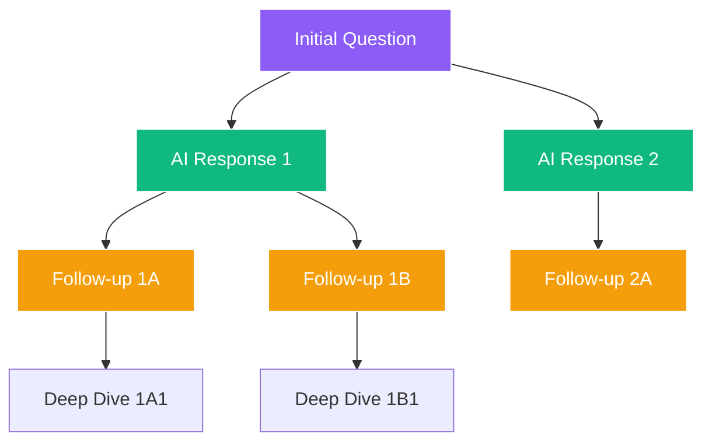
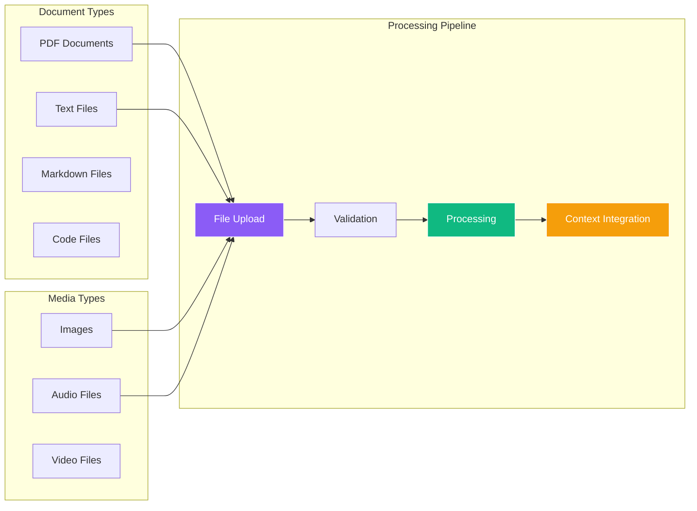
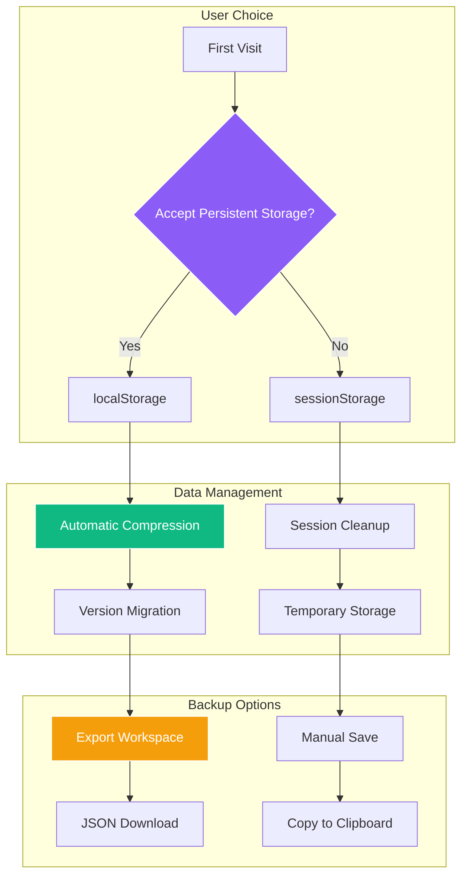

# Aether AI - Features Documentation

<link rel="preconnect" href="https://fonts.googleapis.com">
<link rel="preconnect" href="https://fonts.gstatic.com" crossorigin>
<link href="https://fonts.googleapis.com/css2?family=Major+Mono+Display&family=Space+Grotesk:wght@300..700&display=swap" rel="stylesheet">

<div align="center">
  <div style="display: flex; align-items: center; justify-content: center; gap: 15px; margin-bottom: 20px;">
    
    <h1 style="font-family: 'Major Mono Display', monospace; font-size: 32px; margin: 0; color: #333;">Features Guide</h1>
  </div>
</div>

Explore the comprehensive feature set of Aether AI's Chat Multiverse. This guide covers all functionality from basic conversation management to advanced AI capabilities.

## Table of Contents

- [Core Features](#core-features)
- [Visual Conversation Trees](#visual-conversation-trees)
- [AI Model Integration](#ai-model-integration)
- [File Upload & Multimedia](#file-upload--multimedia)
- [Web-Grounded Responses](#web-grounded-responses)
- [Workspace Management](#workspace-management)
- [User Interface Features](#user-interface-features)
- [Advanced Capabilities](#advanced-capabilities)
- [Accessibility Features](#accessibility-features)
- [Performance Features](#performance-features)

## Core Features

### 🌳 Visual Conversation Trees

Transform linear AI conversations into explorable, visual trees where every response becomes a node you can navigate and branch from.

**Key Capabilities:**
- **Infinite Branching**: Create unlimited conversation branches from any point
- **Visual Navigation**: Navigate through conversation history using an interactive graph
- **Context Preservation**: Maintain full conversation context across all branches
- **Non-Destructive Exploration**: Explore different conversation paths without losing original threads



**Use Cases:**
- **Research & Analysis**: Compare multiple AI perspectives on the same topic
- **Creative Writing**: Explore different story directions and character developments
- **Problem Solving**: Investigate various solution approaches simultaneously
- **Learning**: Deep dive into topics through branching explanations

### 🤖 Multiple AI Models

Access different AI models optimized for specific tasks and conversation styles.

#### Available Models

| Model | Optimized For | Capabilities |
|-------|---------------|--------------|
| **Gemini 2.5 Flash Preview** | General conversation, thinking | Adaptive reasoning, document understanding |
| **Gemini 2.5 Flash Web + Thinking** | Research, fact-checking | Web grounding, citations, step-by-step reasoning |
| **Gemini 2.0 Flash** | Fast responses | Standard conversations, quick answers |
| **Gemini 2.0 Flash Thinking** | Complex reasoning | Multi-step problem solving |

**Model Features:**
- **Thinking Mode**: Step-by-step reasoning display for complex problems
- **Web Grounding**: Real-time web search integration for current information
- **Document Understanding**: Upload and analyze PDFs, text files, and documents
- **Multimedia Support**: Process images, audio, and video content

### 📁 File Upload & Multimedia

Comprehensive file support for rich, multimodal AI conversations.

**Supported File Types:**



**File Capabilities:**
- **Document Analysis**: Extract text, analyze structure, answer questions about content
- **Image Understanding**: Describe images, extract text (OCR), analyze visual content
- **Audio Processing**: Transcribe audio, understand spoken content
- **Context Inheritance**: Files are accessible across conversation branches
- **Preview Integration**: Built-in preview for common file types

### 🌐 Web-Grounded Responses

Get AI responses backed by real-time web search for current, accurate information.

**Grounding Features:**
- **Real-Time Search**: Live web search integration
- **Source Citations**: Clickable links to original sources
- **Fact Verification**: Cross-reference information across multiple sources
- **Current Events**: Access to up-to-date information and news
- **Research Enhancement**: Combine AI reasoning with factual web data

**Citation Display:**
```
🔍 Sources:
• [Article Title](https://example.com) - Brief snippet
• [Research Paper](https://example.com) - Key findings
• [News Source](https://example.com) - Recent updates
```

## Workspace Management

### 💾 Persistent Storage

**Storage Options:**
- **Session Storage**: Temporary storage that clears when browser closes
- **Persistent Storage**: Saves conversations permanently with user consent
- **Export/Import**: Backup and restore entire workspaces

**Storage Features:**


### 🔄 Import/Export System

**Export Formats:**
- **Complete Workspace**: All nodes, edges, and metadata
- **Individual Conversations**: Single conversation thread
- **Settings Backup**: User preferences and configurations

**Export Data Structure:**
```json
{
  "nodes": [...],
  "edges": [...],
  "activeNodeId": "...",
  "metadata": {
    "exportedAt": 1704067200000,
    "exportVersion": "2.0.0",
    "totalNodes": 15,
    "totalConversations": 3
  }
}
```

## User Interface Features

### 🎨 Modern Design System

**Typography:**
- **Primary Font**: Major Mono Display for headings and branding
- **Secondary Font**: Space Grotesk for body text and UI elements
- **Optimized Readability**: Perfect contrast ratios and sizing

**Visual Design:**
- **Dark Theme**: Eye-friendly dark mode with purple/blue accents
- **Glass Morphism**: Subtle backdrop blur effects
- **Responsive Layout**: Optimized for desktop, tablet, and mobile

### 🔧 Interactive Controls

**Graph Navigation:**
- **Pan & Zoom**: Smooth graph navigation with mouse/touch
- **Node Selection**: Click nodes to view conversation details
- **Edge Visualization**: Clear connection lines between related conversations
- **Minimap**: Overview navigation for large conversation trees

**Context Sidebar:**
- **Conversation History**: Full thread view with message details
- **Document Context**: Display inherited files and attachments
- **Model Information**: Current AI model and settings
- **Quick Actions**: Branch, delete, or reset conversations

### ⚙️ Settings & Customization

**User Preferences:**
- **Model Selection**: Choose default AI models
- **Storage Preferences**: Configure data persistence options
- **UI Customization**: Adjust interface preferences
- **Export Settings**: Configure backup and export options

## Advanced Capabilities

### 🧠 Thinking Mode

Advanced reasoning display that shows the AI's step-by-step thought process.

**Thinking Features:**
- **Reasoning Steps**: Visible thought process breakdown
- **Problem Decomposition**: How complex problems are analyzed
- **Decision Points**: Key reasoning junctions and choices
- **Confidence Indicators**: AI's certainty about different conclusions

### 📊 Analytics & Insights

**Conversation Analytics:**
- **Node Statistics**: Count of conversations, branches, and messages
- **Model Usage**: Tracking of which AI models are used most
- **Storage Usage**: Monitor local storage consumption
- **Performance Metrics**: Response times and system performance

### 🔍 Search & Discovery

**Content Search:**
- **Global Search**: Find content across all conversations
- **Semantic Search**: AI-powered content understanding
- **Filter Options**: Search by model, date, or content type
- **Quick Navigation**: Jump directly to relevant conversations

## Accessibility Features

### ♿ Universal Design

**Keyboard Navigation:**
- **Full Keyboard Support**: Navigate entire interface with keyboard
- **Focus Indicators**: Clear visual focus states
- **Shortcut Keys**: Quick access to common actions
- **Screen Reader Compatible**: ARIA labels and semantic HTML

**Visual Accessibility:**
- **High Contrast**: Optimized contrast ratios
- **Scalable Text**: Support for browser zoom up to 200%
- **Color Independence**: Information not dependent on color alone
- **Motion Preferences**: Respect for reduced motion settings

### 🌐 Internationalization Ready

**Localization Support:**
- **RTL Support**: Right-to-left language compatibility
- **Font Flexibility**: Support for various character sets
- **Date/Time Formatting**: Locale-aware formatting
- **Number Formatting**: Regional number display preferences

## Performance Features

### ⚡ Optimization Strategies

**Frontend Performance:**
- **Code Splitting**: Load only necessary code
- **Lazy Loading**: Components load as needed
- **Virtual Scrolling**: Efficient handling of large conversation lists
- **Debounced Inputs**: Prevent excessive API calls

**Memory Management:**
- **Automatic Cleanup**: Remove unused data from memory
- **Compression**: Intelligent data compression for storage
- **Garbage Collection**: Efficient memory usage patterns
- **Cache Optimization**: Smart caching of API responses

### 📱 Mobile Optimization

**Responsive Features:**
- **Touch Navigation**: Optimized touch interactions
- **Mobile Layout**: Adapted interface for small screens
- **Gesture Support**: Pinch to zoom, swipe navigation
- **Performance Tuning**: Optimized for mobile hardware

## Experimental Features

### 🚀 Coming Soon

**Planned Features:**
- **Voice Conversations**: Speech-to-text and text-to-speech
- **Real-time Collaboration**: Shared workspaces with live updates
- **Plugin System**: Extensible functionality with custom plugins
- **Mobile Apps**: Native iOS and Android applications
- **Team Workspaces**: Multi-user collaboration features

**Beta Features:**
- **Advanced Export Options**: Multiple format support
- **Workspace Templates**: Pre-configured conversation starters
- **Advanced Analytics**: Detailed usage insights
- **Cloud Sync**: Optional cloud storage integration

---

## Feature Comparison Matrix

| Feature Category | Basic User | Power User | Developer |
|------------------|------------|------------|-----------|
| **Conversation Trees** | ✅ | ✅ | ✅ |
| **Multiple AI Models** | ✅ | ✅ | ✅ |
| **File Upload** | ✅ | ✅ | ✅ |
| **Web Grounding** | ✅ | ✅ | ✅ |
| **Persistent Storage** | ✅ | ✅ | ✅ |
| **Export/Import** | ✅ | ✅ | ✅ |
| **Advanced Analytics** | ❌ | ✅ | ✅ |
| **API Integration** | ❌ | ❌ | ✅ |
| **Custom Plugins** | ❌ | ❌ | 🚧 |

## Getting Started with Features

### Quick Feature Tour

1. **Start a Conversation**: Use the prompt bar to begin
2. **Create Branches**: Click the "+" button on any response
3. **Upload Files**: Drag and drop files into the conversation
4. **Switch Models**: Use the model selector for different AI capabilities
5. **Enable Web Search**: Toggle grounding for research-backed responses
6. **Save Your Work**: Accept persistent storage for automatic saving

### Advanced Usage Tips

- **Keyboard Shortcuts**: Learn key combinations for faster navigation
- **Model Selection**: Choose appropriate models for specific tasks
- **File Organization**: Use descriptive names for uploaded files
- **Branch Strategy**: Plan conversation branches for maximum exploration
- **Export Regularly**: Backup important conversations periodically

---

## Related Documentation

- [User Guide](./USER_GUIDE.md) - Complete usage instructions
- [Architecture Guide](./ARCHITECTURE.md) - Technical architecture details
- [API Reference](./API.md) - Developer API documentation
- [Development Guide](./DEVELOPMENT.md) - Contributing to features
- [Quick Start Guide](./QUICK_START.md) - Get started in minutes

---

<div align="center">
  <p style="font-family: 'Space Grotesk', sans-serif;">
    Discover more features as you explore the <span style="font-family: 'Major Mono Display', monospace;">Aether</span> multiverse.
    <br>
    <a href="https://aether.sriujjwalreddy.com">Try the live demo</a> or 
    <a href="https://github.com/sbeeredd04/Aether/issues">suggest new features</a>.
  </p>
</div>