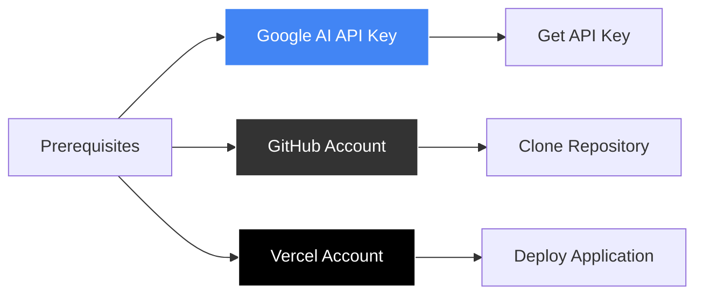

# Aether AI - Installation Guide

<link rel="preconnect" href="https://fonts.googleapis.com">
<link rel="preconnect" href="https://fonts.gstatic.com" crossorigin>
<link href="https://fonts.googleapis.com/css2?family=Major+Mono+Display&family=Space+Grotesk:wght@300..700&display=swap" rel="stylesheet">

<div align="center">
  <div style="display: flex; align-items: center; justify-content: center; gap: 15px; margin-bottom: 20px;">
    
    <h1 style="font-family: 'Major Mono Display', monospace; font-size: 32px; margin: 0; color: #333;">Installation Guide</h1>
  </div>
</div>

Comprehensive installation guide for Aether AI across different platforms and environments. From local development to production deployment.

## Table of Contents

- [Prerequisites](#prerequisites)
- [Quick Installation](#quick-installation)
- [Detailed Setup](#detailed-setup)
- [Environment Configuration](#environment-configuration)
- [Development Tools](#development-tools)
- [Platform-Specific Instructions](#platform-specific-instructions)
- [Docker Setup](#docker-setup)
- [Production Deployment](#production-deployment)
- [Troubleshooting](#troubleshooting)
- [Verification](#verification)

## Prerequisites

### System Requirements

| Component | Minimum | Recommended |
|-----------|---------|-------------|
| **Node.js** | 18.0.0 | 20.0.0+ |
| **npm** | 9.0.0 | 10.0.0+ |
| **RAM** | 4GB | 8GB+ |
| **Storage** | 1GB | 2GB+ |
| **Browser** | Chrome 90+ | Latest Chrome/Firefox |

### Required Accounts



**Google AI API Key** (Required)
- Visit [Google AI Studio](https://makersuite.google.com/app/apikey)
- Create new API key
- Keep it secure - never commit to version control

**GitHub Account** (For development)
- Fork the repository
- Clone your fork locally
- Submit pull requests

**Vercel Account** (For deployment)
- Connect GitHub repository
- Automatic deployments on push
- Environment variable management

## Quick Installation

### One-Line Install (Unix/macOS)

```bash
curl -fsSL https://raw.githubusercontent.com/sbeeredd04/Aether/main/install.sh | bash
```

### Manual Quick Setup

```bash
# 1. Clone repository
git clone https://github.com/sbeeredd04/Aether.git
cd Aether/aether

# 2. Install dependencies
npm install

# 3. Configure environment
cp .env.example .env.local
echo "GOOGLE_AI_API_KEY=your_api_key_here" >> .env.local

# 4. Start development server
npm run dev

# 5. Open browser
open http://localhost:3000
```

## Detailed Setup

### Step 1: Node.js Installation

**Option A: Official Installer**
1. Visit [nodejs.org](https://nodejs.org/)
2. Download LTS version
3. Run installer with default settings
4. Verify installation: `node --version`

**Option B: Node Version Manager (Recommended)**

```bash
# Install nvm (Unix/macOS)
curl -o- https://raw.githubusercontent.com/nvm-sh/nvm/v0.39.0/install.sh | bash

# Reload shell configuration
source ~/.bashrc

# Install and use Node.js LTS
nvm install --lts
nvm use --lts
nvm alias default node
```

**Option C: Package Managers**

```bash
# macOS with Homebrew
brew install node

# Ubuntu/Debian
curl -fsSL https://deb.nodesource.com/setup_lts.x | sudo -E bash -
sudo apt-get install -y nodejs

# Windows with Chocolatey
choco install nodejs

# Arch Linux
sudo pacman -S nodejs npm
```

### Step 2: Repository Setup

**Clone Repository**
```bash
# HTTPS (recommended for most users)
git clone https://github.com/sbeeredd04/Aether.git

# SSH (if you have SSH keys configured)
git clone git@github.com:sbeeredd04/Aether.git

# Navigate to application directory
cd Aether/aether
```

**Verify Directory Structure**
```bash
ls -la
# Should show:
# - package.json
# - src/
# - public/
# - next.config.ts
# - tailwind.config.js
# - tsconfig.json
```

### Step 3: Dependency Installation

```bash
# Install all dependencies
npm install

# Verify installation
npm list --depth=0

# Check for vulnerabilities
npm audit

# Fix minor vulnerabilities (optional)
npm audit fix
```

**Dependencies Overview:**
- **Core**: Next.js, React, TypeScript
- **UI**: Tailwind CSS, Framer Motion, GSAP
- **State**: Zustand
- **Graph**: React Flow
- **AI**: Google Generative AI
- **Utils**: Various utility libraries

### Step 4: Environment Configuration

**Create Environment File**
```bash
# Copy example configuration
cp .env.example .env.local

# Edit with your preferred editor
nano .env.local
# or
code .env.local
```

**Required Variables**
```env
# Google AI API Key (Required)
GOOGLE_AI_API_KEY=your_gemini_api_key_here

# Optional: Application Configuration
NEXT_PUBLIC_APP_NAME=Aether
NEXT_PUBLIC_APP_VERSION=0.1.0

# Optional: Debug Configuration
NEXT_PUBLIC_DEBUG=false
NODE_ENV=development
```

**Getting Google AI API Key:**
1. Visit [Google AI Studio](https://makersuite.google.com/app/apikey)
2. Sign in with Google account
3. Click "Create API Key"
4. Copy the generated key
5. Add to `.env.local` file

## Environment Configuration

### Environment Variables Reference

| Variable | Required | Default | Description |
|----------|----------|---------|-------------|
| `GOOGLE_AI_API_KEY` | Yes | - | Google Gemini API access key |
| `NEXT_PUBLIC_APP_NAME` | No | Aether | Application display name |
| `NEXT_PUBLIC_APP_VERSION` | No | 0.1.0 | Version display in UI |
| `NEXT_PUBLIC_DEBUG` | No | false | Enable debug logging |
| `NODE_ENV` | No | development | Runtime environment |

### Security Best Practices

**Environment File Security:**
```bash
# Ensure .env.local is in .gitignore
echo ".env.local" >> .gitignore

# Set proper file permissions
chmod 600 .env.local

# Never commit API keys
git status  # Verify .env.local not tracked
```

**API Key Security:**
- Use separate keys for development and production
- Regenerate keys if compromised
- Monitor API usage in Google Cloud Console
- Set up usage limits and alerts

### Multiple Environment Setup

**Development Environment**
```env
# .env.local
GOOGLE_AI_API_KEY=your_dev_api_key
NEXT_PUBLIC_DEBUG=true
NODE_ENV=development
```

**Production Environment**
```env
# .env.production
GOOGLE_AI_API_KEY=your_prod_api_key
NEXT_PUBLIC_DEBUG=false
NODE_ENV=production
```

## Development Tools

### Essential VS Code Extensions

```json
{
  "recommendations": [
    "bradlc.vscode-tailwindcss",
    "ms-vscode.vscode-typescript-next",
    "esbenp.prettier-vscode",
    "ms-vscode.vscode-eslint",
    "formulahendry.auto-rename-tag",
    "christian-kohler.path-intellisense",
    "ms-vscode.vscode-json",
    "yzhang.markdown-all-in-one"
  ]
}
```

**Auto-Install Extensions:**
```bash
# Save to .vscode/extensions.json in project root
mkdir -p .vscode
cat > .vscode/extensions.json << 'EOF'
{
  "recommendations": [
    "bradlc.vscode-tailwindcss",
    "ms-vscode.vscode-typescript-next",
    "esbenp.prettier-vscode",
    "ms-vscode.vscode-eslint"
  ]
}
EOF
```

### Git Configuration

```bash
# Configure Git (if not already done)
git config --global user.name "Your Name"
git config --global user.email "your.email@example.com"

# Set up pre-commit hooks (optional)
npm install --save-dev husky lint-staged
npx husky install
```

### Development Scripts

```bash
# Start development server
npm run dev

# Build for production
npm run build

# Start production server
npm run start

# Run linting
npm run lint

# Type checking
npm run type-check
```

## Platform-Specific Instructions

### Windows Setup

**Prerequisites:**
```powershell
# Install Node.js with Chocolatey
choco install nodejs

# Or install Git Bash for Unix-like commands
choco install git

# Install Windows Terminal (recommended)
winget install Microsoft.WindowsTerminal
```

**Common Windows Issues:**
```powershell
# Fix execution policy for npm scripts
Set-ExecutionPolicy -ExecutionPolicy RemoteSigned -Scope CurrentUser

# Install Windows Build Tools (if needed)
npm install --global windows-build-tools

# Use Git Bash for Unix commands
# Or enable WSL for full Linux environment
```

### macOS Setup

**Prerequisites:**
```bash
# Install Homebrew (if not already installed)
/bin/bash -c "$(curl -fsSL https://raw.githubusercontent.com/Homebrew/install/HEAD/install.sh)"

# Install Node.js
brew install node

# Install Git (usually pre-installed)
brew install git
```

**macOS-Specific Configuration:**
```bash
# Fix npm permissions
sudo chown -R $(whoami) $(npm config get prefix)/{lib/node_modules,bin,share}

# Install Xcode Command Line Tools (if needed)
xcode-select --install
```

### Linux Setup (Ubuntu/Debian)

```bash
# Update package list
sudo apt update

# Install Node.js from NodeSource
curl -fsSL https://deb.nodesource.com/setup_lts.x | sudo -E bash -
sudo apt-get install -y nodejs

# Install Git
sudo apt install git

# Install build essentials
sudo apt install build-essential
```

### Linux Setup (Arch/Manjaro)

```bash
# Install Node.js and npm
sudo pacman -S nodejs npm

# Install Git
sudo pacman -S git

# Install base development tools
sudo pacman -S base-devel
```

## Docker Setup

### Docker Installation

**Dockerfile**
```dockerfile
# Use official Node.js runtime as base image
FROM node:18-alpine

# Set working directory
WORKDIR /app

# Copy package files
COPY package*.json ./

# Install dependencies
RUN npm ci --only=production

# Copy application code
COPY . .

# Build application
RUN npm run build

# Expose port
EXPOSE 3000

# Start application
CMD ["npm", "start"]
```

**Docker Compose**
```yaml
version: '3.8'

services:
  aether:
    build: .
    ports:
      - "3000:3000"
    environment:
      - GOOGLE_AI_API_KEY=${GOOGLE_AI_API_KEY}
      - NODE_ENV=production
    volumes:
      - ./public:/app/public:ro
    restart: unless-stopped

  nginx:
    image: nginx:alpine
    ports:
      - "80:80"
      - "443:443"
    volumes:
      - ./nginx.conf:/etc/nginx/nginx.conf:ro
      - ./ssl:/etc/nginx/ssl:ro
    depends_on:
      - aether
    restart: unless-stopped
```

**Build and Run:**
```bash
# Build Docker image
docker build -t aether-ai .

# Run container
docker run -d \
  --name aether \
  -p 3000:3000 \
  -e GOOGLE_AI_API_KEY=your_api_key \
  aether-ai

# Or use Docker Compose
docker-compose up -d
```

## Production Deployment

### Vercel Deployment (Recommended)

**Method 1: GitHub Integration**
1. Fork the repository on GitHub
2. Sign up for [Vercel](https://vercel.com)
3. Connect GitHub account
4. Import Aether repository
5. Add environment variables in Vercel dashboard
6. Deploy automatically

**Method 2: Vercel CLI**
```bash
# Install Vercel CLI
npm install -g vercel

# Login to Vercel
vercel login

# Deploy from project directory
vercel

# Add environment variables
vercel env add GOOGLE_AI_API_KEY
```

### Manual Deployment

**Build for Production:**
```bash
# Install dependencies
npm ci --only=production

# Build application
npm run build

# Test production build locally
npm start
```

**Server Configuration (Nginx Example):**
```nginx
server {
    listen 80;
    server_name your-domain.com;
    
    location / {
        proxy_pass http://localhost:3000;
        proxy_http_version 1.1;
        proxy_set_header Upgrade $http_upgrade;
        proxy_set_header Connection 'upgrade';
        proxy_set_header Host $host;
        proxy_set_header X-Real-IP $remote_addr;
        proxy_set_header X-Forwarded-For $proxy_add_x_forwarded_for;
        proxy_set_header X-Forwarded-Proto $scheme;
        proxy_cache_bypass $http_upgrade;
    }
}
```

### Environment Variables in Production

**Vercel Dashboard:**
1. Go to Project Settings
2. Navigate to Environment Variables
3. Add `GOOGLE_AI_API_KEY` with your production key
4. Set Environment to "Production"
5. Redeploy to apply changes

**Other Platforms:**
```bash
# Set environment variables before starting
export GOOGLE_AI_API_KEY=your_production_key
export NODE_ENV=production
npm start

# Or use a process manager like PM2
npm install -g pm2
pm2 start npm --name aether -- start
pm2 save
pm2 startup
```

## Troubleshooting

### Common Installation Issues

**Node.js Version Conflicts**
```bash
# Check current version
node --version

# Install specific version with nvm
nvm install 18.17.0
nvm use 18.17.0

# Set as default
nvm alias default 18.17.0
```

**Permission Errors (npm)**
```bash
# Fix npm permissions on Unix systems
sudo chown -R $(whoami) ~/.npm
sudo chown -R $(whoami) /usr/local/lib/node_modules

# Or use nvm to avoid permission issues
```

**Build Failures**
```bash
# Clear npm cache
npm cache clean --force

# Delete node_modules and reinstall
rm -rf node_modules package-lock.json
npm install

# Update npm to latest version
npm install -g npm@latest
```

**Memory Issues During Build**
```bash
# Increase Node.js memory limit
export NODE_OPTIONS="--max-old-space-size=4096"
npm run build

# Or add to package.json scripts
"build": "NODE_OPTIONS='--max-old-space-size=4096' next build"
```

### API Key Issues

**Invalid API Key**
- Verify key is correctly copied
- Check for extra spaces or characters
- Ensure key is enabled in Google Cloud Console
- Verify billing is set up for Google AI

**API Rate Limits**
- Check usage in Google Cloud Console
- Set up monitoring and alerts
- Implement client-side rate limiting
- Consider upgrading API plan

### Performance Issues

**Slow Development Server**
```bash
# Exclude node_modules from file watching
echo "node_modules" >> .gitignore

# Use faster package manager
npm install -g pnpm
pnpm install
pnpm dev
```

**Large Bundle Size**
```bash
# Analyze bundle size
npm install -g @next/bundle-analyzer
npm run build
npm run analyze
```

## Verification

### Installation Verification

**Check All Components:**
```bash
# Verify Node.js
node --version  # Should be 18.0.0+

# Verify npm
npm --version   # Should be 9.0.0+

# Verify project dependencies
npm list        # Should show no errors

# Verify TypeScript
npx tsc --version

# Verify Next.js
npx next --version
```

**Test Application:**
```bash
# Start development server
npm run dev

# In another terminal, test API
curl http://localhost:3000/api/health

# Test build process
npm run build

# Test production mode
npm run start
```

### Functional Testing

**Manual Testing Checklist:**
- [ ] Application loads at http://localhost:3000
- [ ] Landing page displays correctly
- [ ] Can enter workspace
- [ ] Can type in prompt bar
- [ ] Can send messages (with valid API key)
- [ ] AI responses are generated
- [ ] Can create branches
- [ ] File upload works
- [ ] Settings panel opens
- [ ] Export/import functions work

**Automated Testing:**
```bash
# Run any existing tests
npm test

# Type checking
npm run type-check

# Linting
npm run lint
```

### Performance Verification

**Development Metrics:**
- Cold start: < 5 seconds
- Hot reload: < 1 second
- Build time: < 2 minutes
- Bundle size: < 2MB

**Production Metrics:**
- First load: < 3 seconds
- Subsequent loads: < 1 second
- Lighthouse score: > 90

---

## Next Steps

After successful installation:

1. **Read the [Quick Start Guide](./QUICK_START.md)** for your first conversation
2. **Explore [User Guide](./USER_GUIDE.md)** for comprehensive usage instructions
3. **Check [Development Guide](./DEVELOPMENT.md)** if you plan to contribute
4. **Review [Troubleshooting](./TROUBLESHOOTING.md)** for common issues

---

<div align="center">
  <p style="font-family: 'Space Grotesk', sans-serif;">
    Installation complete! Ready to explore the <span style="font-family: 'Major Mono Display', monospace;">Aether</span> multiverse?
    <br>
    <a href="https://aether.sriujjwalreddy.com">Try the live demo</a> or start your local development journey.
  </p>
</div>