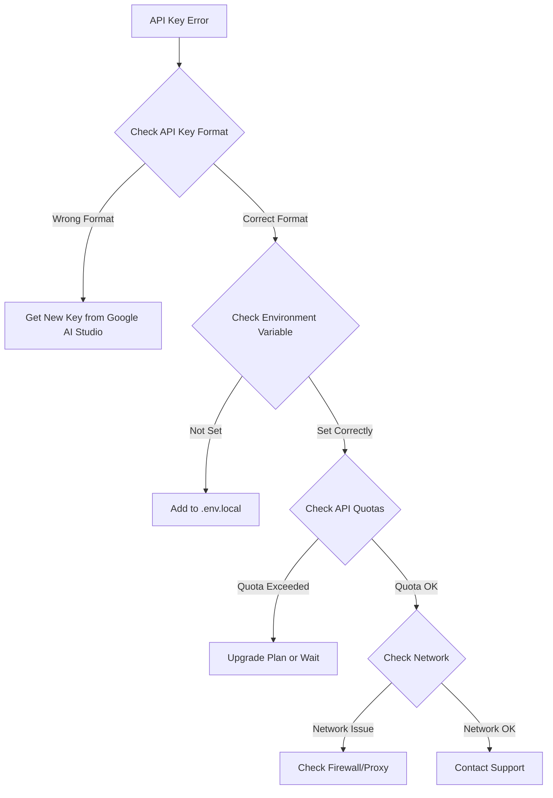

# Aether AI - Troubleshooting Guide

<link rel="preconnect" href="https://fonts.googleapis.com">
<link rel="preconnect" href="https://fonts.gstatic.com" crossorigin>
<link href="https://fonts.googleapis.com/css2?family=Major+Mono+Display&family=Space+Grotesk:wght@300..700&display=swap" rel="stylesheet">

<div align="center">
  <div style="display: flex; align-items: center; justify-content: center; gap: 15px; margin-bottom: 20px;">
    
    <h1 style="font-family: 'Major Mono Display', monospace; font-size: 32px; margin: 0; color: #333;">Troubleshooting</h1>
  </div>
</div>

Comprehensive troubleshooting guide for common issues, error resolution, and debugging techniques in Aether AI.

## Table of Contents

- [Quick Diagnostics](#quick-diagnostics)
- [Installation Issues](#installation-issues)
- [API and Authentication](#api-and-authentication)
- [Performance Problems](#performance-problems)
- [Browser and Storage Issues](#browser-and-storage-issues)
- [File Upload Problems](#file-upload-problems)
- [Graph and UI Issues](#graph-and-ui-issues)
- [Deployment Issues](#deployment-issues)
- [Development Problems](#development-problems)
- [Error Messages Guide](#error-messages-guide)
- [Debug Tools and Techniques](#debug-tools-and-techniques)
- [Getting Help](#getting-help)

## Quick Diagnostics

### System Health Check

Run this quick diagnostic to identify common issues:

```bash
# Check Node.js version
node --version
# Expected: v18.0.0 or higher

# Check npm version  
npm --version
# Expected: 9.0.0 or higher

# Check if port 3000 is available
netstat -an | grep 3000
# Should be empty or show your Aether process

# Test API key (replace with your key)
curl -H "Authorization: Bearer YOUR_API_KEY" \
  "https://generativelanguage.googleapis.com/v1beta/models"
```

### Quick Fix Checklist

Before diving deep, try these quick fixes:

- [ ] **Refresh the page** (Ctrl+F5 or Cmd+Shift+R)
- [ ] **Clear browser cache** and cookies
- [ ] **Check internet connection**
- [ ] **Verify API key** is correct and active
- [ ] **Restart development server** (Ctrl+C, then `npm run dev`)
- [ ] **Update dependencies** (`npm update`)
- [ ] **Check browser console** for error messages (F12)

## Installation Issues

### Node.js and npm Problems

**Issue: "node: command not found"**
```bash
# Solution: Install Node.js
# macOS with Homebrew
brew install node

# Ubuntu/Debian
curl -fsSL https://deb.nodesource.com/setup_lts.x | sudo -E bash -
sudo apt-get install -y nodejs

# Windows
# Download from https://nodejs.org/
```

**Issue: npm permission errors**
```bash
# Unix/macOS solution
sudo chown -R $(whoami) ~/.npm
sudo chown -R $(whoami) /usr/local/lib/node_modules

# Alternative: Use nvm
curl -o- https://raw.githubusercontent.com/nvm-sh/nvm/v0.39.0/install.sh | bash
nvm install --lts
nvm use --lts
```

**Issue: "EACCES: permission denied" during npm install**
```bash
# Fix npm permissions
npm config set prefix '~/.npm-global'
echo 'export PATH=~/.npm-global/bin:$PATH' >> ~/.bashrc
source ~/.bashrc

# Or use npx instead of global installs
npx create-next-app@latest
```

### Dependency Installation Problems

**Issue: Package-lock.json conflicts**
```bash
# Solution: Clean install
rm -rf node_modules package-lock.json
npm cache clean --force
npm install
```

**Issue: Peer dependency warnings**
```bash
# Check peer dependencies
npm ls --depth=0

# Install missing peer dependencies
npm install <missing-package>

# Force install (if safe)
npm install --legacy-peer-deps
```

**Issue: "Module not found" errors**
```bash
# Verify installation
ls node_modules/

# Reinstall specific package
npm uninstall <package-name>
npm install <package-name>

# Clear cache
npm cache clean --force
```

### Build Failures

**Issue: TypeScript compilation errors**
```bash
# Check TypeScript configuration
npx tsc --noEmit

# Update TypeScript
npm install typescript@latest

# Skip TypeScript errors (temporary)
npm run build -- --no-type-check
```

**Issue: Out of memory during build**
```bash
# Increase Node.js memory limit
export NODE_OPTIONS="--max-old-space-size=4096"
npm run build

# Add to package.json scripts
"build": "NODE_OPTIONS='--max-old-space-size=4096' next build"
```

## API and Authentication

### Google AI API Issues

**Issue: "API key not valid" error**



**Solution Steps:**
1. **Verify API Key Format:**
   ```bash
   # API key should start with "AIza" and be 39+ characters
   echo $GOOGLE_AI_API_KEY | wc -c
   # Should output 40 or more
   ```

2. **Test API Key:**
   ```bash
   curl -H "x-goog-api-key: $GOOGLE_AI_API_KEY" \
     "https://generativelanguage.googleapis.com/v1beta/models"
   ```

3. **Check Environment File:**
   ```bash
   # Verify .env.local exists and has correct content
   cat .env.local
   # Should show: GOOGLE_AI_API_KEY=AIza...
   ```

**Issue: Rate limiting errors**
```bash
# Check current usage
curl -H "x-goog-api-key: $GOOGLE_AI_API_KEY" \
  "https://generativelanguage.googleapis.com/v1beta/models" -w "%{http_code}"

# Implement exponential backoff
# Add to your code:
const delay = Math.min(1000 * Math.pow(2, retryCount), 10000);
await new Promise(resolve => setTimeout(resolve, delay));
```

**Issue: CORS errors with API calls**
```javascript
// Check if using correct endpoint
const API_ENDPOINT = 'https://generativelanguage.googleapis.com/v1beta';

// Verify headers
const headers = {
  'Content-Type': 'application/json',
  'x-goog-api-key': process.env.GOOGLE_AI_API_KEY
};
```

### Authentication Problems

**Issue: API responses are empty or malformed**
```bash
# Enable debugging
export DEBUG=true
npm run dev

# Check network tab in browser dev tools
# Look for failed requests or unexpected responses
```

**Issue: Intermittent API failures**
```javascript
// Add retry logic
const retryApiCall = async (fn, maxRetries = 3) => {
  for (let i = 0; i < maxRetries; i++) {
    try {
      return await fn();
    } catch (error) {
      if (i === maxRetries - 1) throw error;
      await new Promise(resolve => setTimeout(resolve, 1000 * (i + 1)));
    }
  }
};
```

## Performance Problems

### Slow Application Startup

**Issue: Development server takes too long to start**
```bash
# Check for large node_modules
du -sh node_modules/

# Clean and reinstall
rm -rf node_modules package-lock.json
npm install

# Use faster package manager
npm install -g pnpm
pnpm install
pnpm dev
```

**Issue: Hot reload is slow**
```javascript
// Add to next.config.js
const nextConfig = {
  webpack: (config, { dev }) => {
    if (dev) {
      config.watchOptions = {
        poll: 1000,
        aggregateTimeout: 300,
        ignored: ['node_modules/**'],
      };
    }
    return config;
  },
};
```

### Runtime Performance Issues

**Issue: UI feels sluggish or unresponsive**
```bash
# Check memory usage
# Open browser dev tools → Performance tab
# Record performance profile

# Check for memory leaks
# Dev tools → Memory tab → Take heap snapshot
```

**Solution: Optimize React components**
```javascript
// Use React.memo for expensive components
const ExpensiveComponent = React.memo(({ data }) => {
  // Component logic
});

// Use useCallback for event handlers
const handleClick = useCallback(() => {
  // Handler logic
}, [dependencies]);

// Use useMemo for expensive calculations
const expensiveValue = useMemo(() => {
  return heavyCalculation(data);
}, [data]);
```

**Issue: Large conversation trees cause lag**
```javascript
// Implement virtualization for large lists
import { FixedSizeList as List } from 'react-window';

const VirtualizedMessageList = ({ messages }) => (
  <List
    height={400}
    itemCount={messages.length}
    itemSize={60}
  >
    {({ index, style }) => (
      <div style={style}>
        {messages[index]}
      </div>
    )}
  </List>
);
```

### Network Performance

**Issue: API calls are slow**
```bash
# Test network latency
ping generativelanguage.googleapis.com

# Test API response time
curl -w "@curl-format.txt" -o /dev/null \
  -H "x-goog-api-key: $API_KEY" \
  "https://generativelanguage.googleapis.com/v1beta/models"
```

**Solution: Implement request optimization**
```javascript
// Add request timeout
const controller = new AbortController();
setTimeout(() => controller.abort(), 30000);

fetch(url, {
  signal: controller.signal,
  // other options
});

// Implement request deduplication
const requestCache = new Map();
const deduplicatedFetch = (url, options) => {
  const key = `${url}-${JSON.stringify(options)}`;
  if (requestCache.has(key)) {
    return requestCache.get(key);
  }
  const promise = fetch(url, options);
  requestCache.set(key, promise);
  return promise;
};
```

## Browser and Storage Issues

### Storage Problems

**Issue: "localStorage is full" error**
```javascript
// Check storage usage
const storageSize = JSON.stringify(localStorage).length;
console.log(`Storage used: ${storageSize} bytes`);

// Clear old data
const clearOldData = () => {
  const keys = Object.keys(localStorage);
  keys.forEach(key => {
    if (key.startsWith('aether_old_')) {
      localStorage.removeItem(key);
    }
  });
};

// Implement storage cleanup
const manageStorageQuota = () => {
  try {
    localStorage.setItem('test', 'test');
    localStorage.removeItem('test');
  } catch (e) {
    // Storage full, clear old data
    clearOldData();
  }
};
```

**Issue: Data not persisting between sessions**
```javascript
// Check if localStorage is available
const isStorageAvailable = () => {
  try {
    const test = '__storage_test__';
    localStorage.setItem(test, test);
    localStorage.removeItem(test);
    return true;
  } catch (e) {
    return false;
  }
};

// Fallback to sessionStorage
const storage = isStorageAvailable() ? localStorage : sessionStorage;
```

**Issue: Storage quota exceeded**
```javascript
// Monitor storage usage
const getStorageSize = () => {
  let total = 0;
  for (let key in localStorage) {
    if (localStorage.hasOwnProperty(key)) {
      total += localStorage[key].length + key.length;
    }
  }
  return total;
};

// Implement compression
const compress = (data) => {
  // Simple compression - remove unnecessary whitespace
  return JSON.stringify(data, null, 0);
};
```

### Browser Compatibility

**Issue: Features not working in certain browsers**
```javascript
// Check browser support
const checkBrowserSupport = () => {
  const features = {
    localStorage: !!window.localStorage,
    fetch: !!window.fetch,
    promises: !!window.Promise,
    modules: 'noModule' in HTMLScriptElement.prototype,
  };
  
  console.log('Browser features:', features);
  return Object.values(features).every(Boolean);
};

// Add polyfills if needed
if (!window.fetch) {
  import('whatwg-fetch');
}
```

**Issue: Safari-specific problems**
```javascript
// Safari localStorage in private mode
const isSafariPrivate = () => {
  try {
    localStorage.setItem('test', '1');
    localStorage.removeItem('test');
    return false;
  } catch (e) {
    return true;
  }
};

// Handle Safari private mode
if (isSafariPrivate()) {
  // Use sessionStorage instead
  const storage = sessionStorage;
}
```

## File Upload Problems

### Upload Failures

**Issue: Files not uploading**
```javascript
// Check file size limits
const MAX_FILE_SIZE = 10 * 1024 * 1024; // 10MB

const validateFile = (file) => {
  if (file.size > MAX_FILE_SIZE) {
    throw new Error(`File too large: ${file.size} bytes`);
  }
  
  const allowedTypes = [
    'image/jpeg', 'image/png', 'image/gif',
    'application/pdf', 'text/plain'
  ];
  
  if (!allowedTypes.includes(file.type)) {
    throw new Error(`File type not supported: ${file.type}`);
  }
};
```

**Issue: File reading errors**
```javascript
// Robust file reading
const readFileAsDataURL = (file) => {
  return new Promise((resolve, reject) => {
    const reader = new FileReader();
    
    reader.onload = () => resolve(reader.result);
    reader.onerror = () => reject(new Error('Failed to read file'));
    reader.onabort = () => reject(new Error('File reading aborted'));
    
    // Add timeout
    setTimeout(() => {
      reader.abort();
      reject(new Error('File reading timeout'));
    }, 30000);
    
    reader.readAsDataURL(file);
  });
};
```

**Issue: Memory issues with large files**
```javascript
// Process files in chunks
const processLargeFile = async (file) => {
  const CHUNK_SIZE = 1024 * 1024; // 1MB chunks
  const chunks = [];
  
  for (let start = 0; start < file.size; start += CHUNK_SIZE) {
    const chunk = file.slice(start, start + CHUNK_SIZE);
    const processedChunk = await processChunk(chunk);
    chunks.push(processedChunk);
    
    // Allow UI to update
    await new Promise(resolve => setTimeout(resolve, 0));
  }
  
  return chunks.join('');
};
```

### File Type Issues

**Issue: Unsupported file types**
```javascript
// Enhanced file type detection
const detectFileType = (file) => {
  // Check MIME type
  if (file.type) {
    return file.type;
  }
  
  // Fallback to extension
  const extension = file.name.split('.').pop().toLowerCase();
  const mimeTypes = {
    'pdf': 'application/pdf',
    'txt': 'text/plain',
    'md': 'text/markdown',
    'jpg': 'image/jpeg',
    'jpeg': 'image/jpeg',
    'png': 'image/png',
    'gif': 'image/gif',
  };
  
  return mimeTypes[extension] || 'application/octet-stream';
};
```

**Issue: File corruption during upload**
```javascript
// Add file integrity checking
const calculateFileHash = async (file) => {
  const buffer = await file.arrayBuffer();
  const hashBuffer = await crypto.subtle.digest('SHA-256', buffer);
  const hashArray = Array.from(new Uint8Array(hashBuffer));
  return hashArray.map(b => b.toString(16).padStart(2, '0')).join('');
};

// Verify file integrity
const verifyFileIntegrity = async (originalFile, processedData) => {
  const originalHash = await calculateFileHash(originalFile);
  const processedHash = await calculateFileHash(
    new Blob([processedData], { type: originalFile.type })
  );
  
  if (originalHash !== processedHash) {
    throw new Error('File corruption detected');
  }
};
```

## Graph and UI Issues

### React Flow Problems

**Issue: Graph not rendering**
```bash
# Check React Flow version compatibility
npm list @xyflow/react

# Update to latest version
npm install @xyflow/react@latest
```

**Issue: Nodes overlapping or poor layout**
```javascript
// Implement auto-layout
import { getLayoutedElements } from 'reactflow';

const layoutElements = (nodes, edges, direction = 'TB') => {
  const layouted = getLayoutedElements(nodes, edges, {
    'elk.algorithm': 'layered',
    'elk.direction': direction,
    'elk.spacing.nodeNode': '80',
    'elk.layered.spacing.nodeNodeBetweenLayers': '100',
  });
  
  return layouted;
};
```

**Issue: Performance issues with large graphs**
```javascript
// Implement node virtualization
const VirtualizedReactFlow = ({ nodes, edges }) => {
  // Only render nodes in viewport
  const [viewportNodes, setViewportNodes] = useState([]);
  
  const onViewportChange = useCallback((viewport) => {
    const visibleNodes = nodes.filter(node => 
      isNodeInViewport(node, viewport)
    );
    setViewportNodes(visibleNodes);
  }, [nodes]);
  
  return (
    <ReactFlow
      nodes={viewportNodes}
      edges={edges}
      onViewportChange={onViewportChange}
    />
  );
};
```

### UI Component Issues

**Issue: Components not updating**
```javascript
// Check for stale closures
const ComponentWithStaleState = () => {
  const [count, setCount] = useState(0);
  
  // Bad: Stale closure
  const badHandler = () => {
    setTimeout(() => {
      setCount(count + 1); // Uses stale count
    }, 1000);
  };
  
  // Good: Functional update
  const goodHandler = () => {
    setTimeout(() => {
      setCount(prev => prev + 1); // Always uses current count
    }, 1000);
  };
};
```

**Issue: CSS styles not applying**
```bash
# Check Tailwind compilation
npm run build

# Verify Tailwind config
npx tailwindcss --init --dry-run

# Check for CSS conflicts
# Use browser dev tools to inspect element styles
```

## Deployment Issues

### Build Failures in Production

**Issue: "Module not found" in production**
```bash
# Check case sensitivity
find . -name "*.js" -o -name "*.ts" | xargs grep -l "import.*Component"

# Fix import paths
# Wrong: import Component from './component';
# Right: import Component from './Component';
```

**Issue: Environment variables not working in production**
```bash
# Verify variables are set
# For Vercel:
vercel env ls

# For other platforms:
echo $GOOGLE_AI_API_KEY

# Check variable naming
# Client variables must start with NEXT_PUBLIC_
```

**Issue: Build timeout errors**
```bash
# Increase build timeout
# In vercel.json:
{
  "builds": [
    {
      "src": "package.json",
      "use": "@vercel/node",
      "config": {
        "maxLambdaSize": "50mb"
      }
    }
  ]
}
```

### Runtime Errors in Production

**Issue: "Hydration mismatch" errors**
```javascript
// Fix SSR/client mismatches
const ClientOnlyComponent = dynamic(
  () => import('./ClientOnlyComponent'),
  { ssr: false }
);

// Use useEffect for client-only code
const [isClient, setIsClient] = useState(false);

useEffect(() => {
  setIsClient(true);
}, []);

if (!isClient) {
  return <div>Loading...</div>;
}
```

**Issue: API routes not working**
```bash
# Check API route structure
ls pages/api/
# Should have proper file structure

# Verify exports
# pages/api/example.js should export default function
```

## Development Problems

### Hot Reload Issues

**Issue: Changes not reflecting**
```bash
# Restart development server
pkill -f "next dev"
npm run dev

# Clear Next.js cache
rm -rf .next

# Check file watching limits (Linux)
echo fs.inotify.max_user_watches=524288 | sudo tee -a /etc/sysctl.conf
sudo sysctl -p
```

**Issue: TypeScript errors blocking development**
```javascript
// Add to next.config.js for development
const nextConfig = {
  typescript: {
    // Skip type checking during development
    ignoreBuildErrors: process.env.NODE_ENV === 'development',
  },
};
```

### IDE and Editor Problems

**Issue: VS Code not recognizing imports**
```json
// Add to .vscode/settings.json
{
  "typescript.preferences.importModuleSpecifier": "relative",
  "typescript.suggest.autoImports": true,
  "typescript.updateImportsOnFileMove.enabled": "always"
}
```

**Issue: ESLint/Prettier conflicts**
```bash
# Install ESLint Prettier integration
npm install --save-dev eslint-config-prettier

# Add to .eslintrc.json
{
  "extends": ["next/core-web-vitals", "prettier"]
}
```

## Error Messages Guide

### Common Error Patterns

**"Cannot read property 'X' of undefined"**
```javascript
// Add defensive programming
const safeAccess = (obj, path) => {
  return path.split('.').reduce((current, key) => {
    return current?.[key];
  }, obj);
};

// Usage
const value = safeAccess(data, 'user.profile.name') || 'Unknown';
```

**"Maximum call stack size exceeded"**
```javascript
// Check for infinite recursion
const recursiveFunction = (data, depth = 0) => {
  // Add depth limit
  if (depth > 100) {
    throw new Error('Maximum recursion depth exceeded');
  }
  
  // Your recursive logic
  return recursiveFunction(newData, depth + 1);
};
```

**"Network Error" or "Failed to fetch"**
```javascript
// Implement robust error handling
const apiCall = async (url, options) => {
  try {
    const response = await fetch(url, {
      ...options,
      timeout: 10000,
    });
    
    if (!response.ok) {
      throw new Error(`HTTP ${response.status}: ${response.statusText}`);
    }
    
    return await response.json();
  } catch (error) {
    if (error.name === 'AbortError') {
      throw new Error('Request timeout');
    }
    throw error;
  }
};
```

### API Error Codes

| Code | Meaning | Solution |
|------|---------|----------|
| 400 | Bad Request | Check request format and parameters |
| 401 | Unauthorized | Verify API key is correct |
| 403 | Forbidden | Check API permissions and quotas |
| 429 | Rate Limited | Implement exponential backoff |
| 500 | Server Error | Retry request, check service status |

## Debug Tools and Techniques

### Browser Developer Tools

**Console Debugging:**
```javascript
// Enhanced logging
const logger = {
  debug: (message, data) => {
    if (process.env.NODE_ENV === 'development') {
      console.log(`🐛 ${message}`, data);
    }
  },
  error: (message, error) => {
    console.error(`❌ ${message}`, error);
  },
  info: (message, data) => {
    console.info(`ℹ️ ${message}`, data);
  }
};

// Usage
logger.debug('API call started', { url, params });
logger.error('API call failed', error);
```

**Performance Profiling:**
```javascript
// Measure performance
const measurePerformance = (label, fn) => {
  const start = performance.now();
  const result = fn();
  const end = performance.now();
  console.log(`${label} took ${end - start} milliseconds`);
  return result;
};

// Usage
const result = measurePerformance('API Call', () => {
  return fetch('/api/data');
});
```

### Network Debugging

**Request Intercepting:**
```javascript
// Log all fetch requests
const originalFetch = window.fetch;
window.fetch = (...args) => {
  console.log('Fetch called with:', args);
  return originalFetch(...args).then(response => {
    console.log('Fetch response:', response);
    return response;
  });
};
```

### State Debugging

**Zustand Store Debugging:**
```javascript
// Add logging middleware
const logger = (config) => (set, get, api) =>
  config(
    (...args) => {
      console.log('Store update:', args);
      set(...args);
    },
    get,
    api
  );

// Usage
const useStore = create(
  logger((set) => ({
    // Store implementation
  }))
);
```

## Getting Help

### Before Asking for Help

1. **Search existing issues** on GitHub
2. **Check the documentation** thoroughly
3. **Try the troubleshooting steps** above
4. **Create a minimal reproduction** of the issue
5. **Gather relevant information**:
   - Browser version
   - Node.js version
   - Operating system
   - Error messages
   - Steps to reproduce

### How to Report Issues

**Create a Good Bug Report:**

```markdown
## Bug Description
Brief description of the issue

## Steps to Reproduce
1. Go to...
2. Click on...
3. See error

## Expected Behavior
What should have happened

## Actual Behavior
What actually happened

## Environment
- OS: [e.g., macOS 13.0]
- Browser: [e.g., Chrome 118]
- Node.js: [e.g., 18.17.0]
- Aether Version: [e.g., 0.1.0]

## Additional Context
Any other relevant information
```

### Community Resources

- **GitHub Issues**: [Report bugs and request features](https://github.com/sbeeredd04/Aether/issues)
- **GitHub Discussions**: [Community help and discussions](https://github.com/sbeeredd04/Aether/discussions)
- **Documentation**: [Complete documentation](./README.md)
- **Email Support**: [sricodespace@gmail.com](mailto:sricodespace@gmail.com)

### Professional Support

For enterprise users or complex issues:
- **Priority Support**: Available for production deployments
- **Custom Solutions**: Tailored implementations
- **Training**: Team training and onboarding
- **Consulting**: Architecture and optimization guidance

---

## Prevention Tips

### Best Practices

1. **Keep Dependencies Updated**
   ```bash
   npm audit
   npm update
   npm outdated
   ```

2. **Use Version Control**
   ```bash
   git commit -m "Working state before changes"
   git branch feature/new-feature
   ```

3. **Test in Multiple Environments**
   - Different browsers
   - Different devices
   - Different network conditions

4. **Monitor Application Health**
   - Set up error tracking
   - Monitor performance metrics
   - Regular backup procedures

5. **Document Changes**
   - Keep a changelog
   - Document configuration changes
   - Share knowledge with team

---

<div align="center">
  <p style="font-family: 'Space Grotesk', sans-serif;">
    Still having issues? Don't hesitate to reach out!
    <br>
    The <span style="font-family: 'Major Mono Display', monospace;">Aether</span> community is here to help.
    <br>
    <a href="https://github.com/sbeeredd04/Aether/issues">Open an issue</a> or 
    <a href="mailto:sricodespace@gmail.com">contact support</a>.
  </p>
</div>