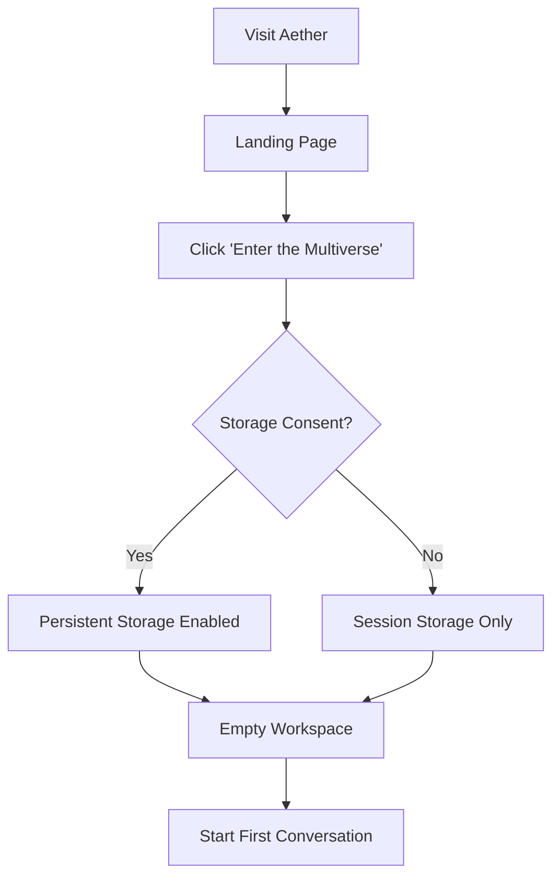
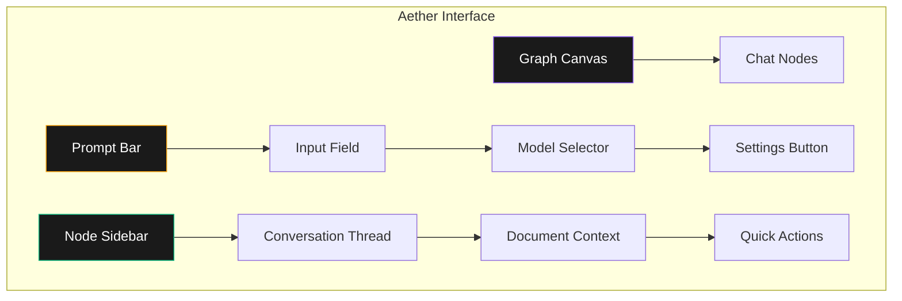
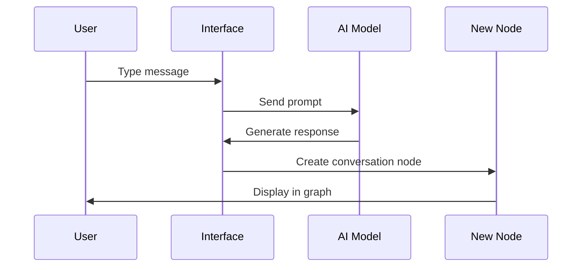
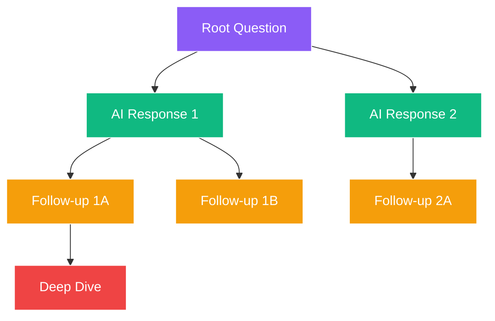
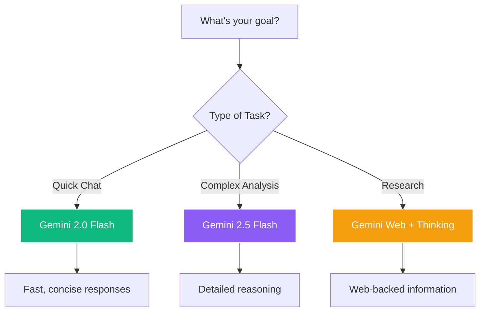

# Aether AI - User Guide

<link rel="preconnect" href="https://fonts.googleapis.com">
<link rel="preconnect" href="https://fonts.gstatic.com" crossorigin>
<link href="https://fonts.googleapis.com/css2?family=Major+Mono+Display&family=Space+Grotesk:wght@300..700&display=swap" rel="stylesheet">

<div align="center">
  <div style="display: flex; align-items: center; justify-content: center; gap: 15px; margin-bottom: 20px;">
    
    <h1 style="font-family: 'Major Mono Display', monospace; font-size: 32px; margin: 0; color: #333;">User Guide</h1>
  </div>
</div>

Complete guide to using Aether AI's Chat Multiverse. Master the art of visual conversations and unlock the full potential of branching AI dialogue trees.

## Table of Contents

- [Getting Started](#getting-started)
- [Understanding the Interface](#understanding-the-interface)
- [Creating Conversations](#creating-conversations)
- [Branching and Navigation](#branching-and-navigation)
- [File Upload and Attachments](#file-upload-and-attachments)
- [AI Model Selection](#ai-model-selection)
- [Web-Grounded Responses](#web-grounded-responses)
- [Managing Your Workspace](#managing-your-workspace)
- [Advanced Features](#advanced-features)
- [Tips and Best Practices](#tips-and-best-practices)
- [Troubleshooting](#troubleshooting)

## Getting Started

### First Visit

When you first visit Aether AI, you'll see:

1. **Landing Page**: Introduction to the concept with animated background
2. **Workspace Button**: "Enter the Multiverse" to begin
3. **Storage Consent**: Optional prompt for persistent storage



### Storage Options

**Session Storage (Default)**
- Conversations saved until browser closes
- No data persistence across sessions
- More privacy-focused

**Persistent Storage (Optional)**
- Conversations saved permanently in browser
- Automatic data compression for large trees
- Export/import capabilities
- Requires user consent

## Understanding the Interface

### Main Components



### Graph Canvas

The main workspace where your conversation trees live:

- **Pan**: Click and drag empty space to move around
- **Zoom**: Mouse wheel or pinch to zoom in/out
- **Select**: Click nodes to view their conversations
- **Background**: Animated silk effects for visual appeal

### Chat Nodes

Individual conversation bubbles containing:

- **Messages**: User and AI message history
- **Labels**: Automatically generated or custom titles
- **Actions**: Branch, delete, and navigation buttons
- **Status**: Loading indicators during AI generation

### Prompt Bar

Your command center at the bottom:

- **Text Input**: Multi-line text area for messages
- **File Upload**: Drag-and-drop or click to upload
- **Model Selector**: Choose AI model for responses
- **Settings**: Access configuration options
- **Send Button**: Submit your message

### Node Sidebar

Context panel showing:

- **Full Thread**: Complete conversation from root to current node
- **Document Context**: Files available in this conversation branch
- **Quick Actions**: Reset, delete, branch operations
- **Model Info**: Current AI model and capabilities

## Creating Conversations

### Your First Message

1. **Type Your Message**: Click the text area and start typing
2. **Choose Model**: Select appropriate AI model (optional)
3. **Add Context**: Upload files if needed (optional)
4. **Send**: Click send button or press Enter



### Message Types

**Text Messages**
- Plain text questions and prompts
- Markdown formatting supported
- Code blocks with syntax highlighting

**File-Based Messages**
- Upload documents for analysis
- Include images for visual understanding
- Add audio files for transcription

**Follow-up Questions**
- Reference previous messages in the thread
- Build upon AI responses
- Explore different aspects of the topic

## Branching and Navigation

### Creating Branches

Branches allow you to explore different conversation paths without losing your original thread.

**From Any Response:**
1. Click the **+** button on any AI response
2. Type your alternative question or follow-up
3. Watch as a new conversation branch is created

**Branch Types:**
- **Alternative Questions**: Ask the same thing differently
- **Follow-up Exploration**: Dive deeper into specific aspects
- **What-if Scenarios**: Explore hypothetical situations
- **Comparative Analysis**: Get different perspectives

### Navigation Patterns



**Linear Navigation**: Follow a single conversation path
**Branching Exploration**: Create multiple paths from decision points
**Comparison Navigation**: Switch between branches to compare responses

### Graph Management

**Organizing Your Tree:**
- Drag nodes to rearrange layout
- Use sidebar to navigate long conversation threads
- Click minimap for overview of large trees

**Best Practices:**
- Keep related branches close together
- Use clear, descriptive questions for easier navigation
- Don't be afraid to create many branches

## File Upload and Attachments

### Supported File Types

| Category | Formats | Max Size | Use Cases |
|----------|---------|----------|-----------|
| **Documents** | PDF, TXT, MD, DOC | 10MB | Research, analysis, summaries |
| **Images** | JPG, PNG, GIF, WEBP | 5MB | Visual analysis, OCR, descriptions |
| **Code** | JS, PY, TS, JSON, etc. | 2MB | Code review, debugging, explanations |
| **Audio** | MP3, WAV, M4A | 10MB | Transcription, content analysis |

### Upload Methods

**Drag and Drop**
1. Drag files directly onto the prompt bar
2. See preview with file name and type
3. Type your question about the file
4. Send to include file in conversation

**Click Upload**
1. Click the upload button in prompt bar
2. Browse and select files
3. Preview appears in interface
4. Continue with your message

### File Context

Files become part of your conversation context:
- **Inheritance**: Files are available to all branches from that point
- **Persistence**: Files are saved with your conversation tree
- **Preview**: Built-in preview for common file types
- **Analysis**: AI can analyze, summarize, and answer questions about files

### Working with Documents

**PDF Analysis:**
```
"Summarize this research paper" [upload PDF]
├── "What are the key findings?"
├── "How does this compare to other studies?"
└── "What are the limitations mentioned?"
```

**Image Understanding:**
```
"Describe this image" [upload image]
├── "Extract any text from this image"
├── "What style of art is this?"
└── "Can you recreate this in a different style?"
```

**Code Review:**
```
"Review this code for bugs" [upload .js file]
├── "How can I optimize performance?"
├── "Add error handling to this code"
└── "Convert this to TypeScript"
```

## AI Model Selection

### Available Models

**Gemini 2.0 Flash**
- **Best For**: Quick conversations, general questions
- **Speed**: Very fast responses
- **Features**: Standard text generation

**Gemini 2.5 Flash Preview**
- **Best For**: Complex reasoning, detailed analysis
- **Speed**: Moderate
- **Features**: Thinking mode, advanced reasoning

**Gemini 2.5 Flash Web + Thinking**
- **Best For**: Research, fact-checking, current events
- **Speed**: Slower but comprehensive
- **Features**: Web search, citations, step-by-step reasoning

### Choosing the Right Model



### Model Switching

You can change models:
- **Per Message**: Select model before sending each message
- **Per Branch**: Different branches can use different models
- **Comparison**: Create branches to compare model responses

## Web-Grounded Responses

### When to Use Grounding

**Current Information**
- News and current events
- Recent research findings
- Stock prices, weather, sports scores
- Technology updates

**Fact Checking**
- Verify claims and statistics
- Cross-reference information
- Find authoritative sources
- Check for recent updates

**Research Enhancement**
- Find supporting evidence
- Discover related studies
- Locate expert opinions
- Access primary sources

### Understanding Citations

Grounded responses include:
- **Source Links**: Clickable links to original content
- **Snippets**: Brief excerpts from sources
- **Confidence Indicators**: AI assessment of source reliability
- **Multiple Sources**: Cross-referencing for accuracy

### Best Practices

1. **Be Specific**: Ask for recent or current information
2. **Request Sources**: Ask for citations and references
3. **Cross-Reference**: Use multiple branches to verify information
4. **Evaluate Sources**: Check the credibility of cited sources

## Managing Your Workspace

### Storage Management

**View Storage Usage**
- Check current data usage in settings
- Monitor available space
- Set up automatic cleanup

**Data Compression**
- Large conversations are automatically compressed
- Maintains full functionality with smaller storage footprint
- Background compression doesn't interrupt usage

### Export and Backup

**Export Options:**
- **Complete Workspace**: All conversations, nodes, and edges
- **Single Conversation**: Specific conversation thread
- **Selected Branches**: Choose which parts to export

**Export Formats:**
- **JSON**: Full data structure for re-import
- **Markdown**: Human-readable conversation export
- **PDF**: Printable conversation summary

**Import Process:**
1. Choose "Import Workspace" from settings
2. Select your JSON export file
3. Choose merge or replace existing data
4. Verify import success

### Workspace Organization

**Node Management:**
- **Arrange**: Drag nodes to organize layout
- **Label**: Custom titles for important conversations
- **Color Coding**: Visual organization (coming soon)
- **Search**: Find specific conversations or content

**Conversation Hygiene:**
- Regularly export important conversations
- Delete experimental or test branches
- Merge related conversation threads
- Archive completed projects

## Advanced Features

### Thinking Mode

When available, thinking mode shows:
- **Reasoning Steps**: How the AI approached the problem
- **Decision Points**: Key choices in the thought process
- **Confidence Levels**: AI's certainty about conclusions
- **Alternative Approaches**: Other ways to solve the problem

### Batch Operations

**Multi-Node Selection:**
- Hold Ctrl/Cmd to select multiple nodes
- Apply actions to all selected nodes
- Bulk delete or organize operations

**Template Conversations:**
- Save conversation patterns as templates
- Quick-start new projects with proven structures
- Share templates with team members (coming soon)

### Collaboration Features (Coming Soon)

- **Shared Workspaces**: Real-time collaboration
- **Comments**: Add notes to conversation nodes
- **Version History**: Track changes over time
- **Access Control**: Manage permissions

## Tips and Best Practices

### Conversation Strategy

**Start Broad, Then Focus**
```
"Explain machine learning" (root)
├── "What are the main types?" (categories)
│   ├── "How does supervised learning work?" (specific)
│   └── "Examples of unsupervised learning?" (examples)
└── "What industries use ML?" (applications)
```

**Use Comparative Branching**
```
"Write a story about time travel"
├── "Make it more scientifically accurate"
├── "Focus on emotional impact"
└── "Add humor and comedy elements"
```

**Build Knowledge Trees**
```
"Python programming basics"
├── "Variables and data types"
├── "Control structures"
├── "Functions and modules"
└── "Object-oriented programming"
```

### Productivity Tips

1. **Upload Context First**: Add relevant files before asking questions
2. **Use Descriptive Prompts**: Clear questions get better responses
3. **Branch Before Editing**: Create branches instead of rewriting
4. **Export Regularly**: Backup important conversations
5. **Organize as You Go**: Arrange nodes for easy navigation

### Common Workflows

**Research Project**
1. Start with broad topic overview
2. Branch into specific research questions
3. Upload relevant papers/sources
4. Use web grounding for current information
5. Compare findings across branches
6. Export final research summary

**Creative Writing**
1. Begin with basic story concept
2. Branch for character development
3. Explore different plot directions
4. Test various writing styles
5. Combine best elements from different branches
6. Export final narrative

**Problem Solving**
1. Define the problem clearly
2. Branch into different solution approaches
3. Analyze pros and cons in separate branches
4. Test solutions with hypothetical scenarios
5. Combine insights for optimal solution
6. Document decision process

## Troubleshooting

### Common Issues

**Messages Not Sending**
- Check internet connection
- Verify API key is valid
- Try refreshing the page
- Clear browser cache

**Slow Performance**
- Close unused browser tabs
- Clear conversation history if very large
- Check for browser updates
- Reduce number of open branches

**Storage Issues**
- Check available browser storage
- Export and delete old conversations
- Clear browser data if needed
- Use session storage for temporary work

**File Upload Problems**
- Check file size limits
- Verify file format is supported
- Try converting to a supported format
- Clear browser cache

### Getting Help

**Documentation Resources:**
- [Quick Start Guide](./QUICK_START.md) - Getting started quickly
- [Features Guide](./FEATURES.md) - Detailed feature explanations
- [API Reference](./API.md) - Technical documentation
- [Architecture Guide](./ARCHITECTURE.md) - System overview

**Support Channels:**
- [GitHub Issues](https://github.com/sbeeredd04/Aether/issues) - Bug reports and feature requests
- [GitHub Discussions](https://github.com/sbeeredd04/Aether/discussions) - Community help
- [Email Support](mailto:sricodespace@gmail.com) - Direct assistance

### Reporting Issues

When reporting problems:
1. **Describe the Issue**: What went wrong?
2. **Steps to Reproduce**: How can we recreate it?
3. **Expected Behavior**: What should have happened?
4. **Browser Info**: Which browser and version?
5. **Console Errors**: Any error messages in browser console?

---

## Next Steps

### Mastering Aether

1. **Practice Branching**: Experiment with different conversation structures
2. **Explore Models**: Try different AI models for various tasks
3. **Upload Files**: Practice with different file types
4. **Organize Workspaces**: Develop your personal organization system
5. **Share Knowledge**: Help others in the community

### Advanced Usage

- **Developer Mode**: Explore the technical architecture
- **API Integration**: Use programmatic access (coming soon)
- **Custom Plugins**: Extend functionality (planned feature)
- **Team Collaboration**: Set up shared workspaces

---

<div align="center">
  <p style="font-family: 'Space Grotesk', sans-serif;">
    Master the multiverse and unlock infinite conversation possibilities.
    <br>
    <a href="https://aether.sriujjwalreddy.com">Start exploring now!</a>
  </p>
</div>